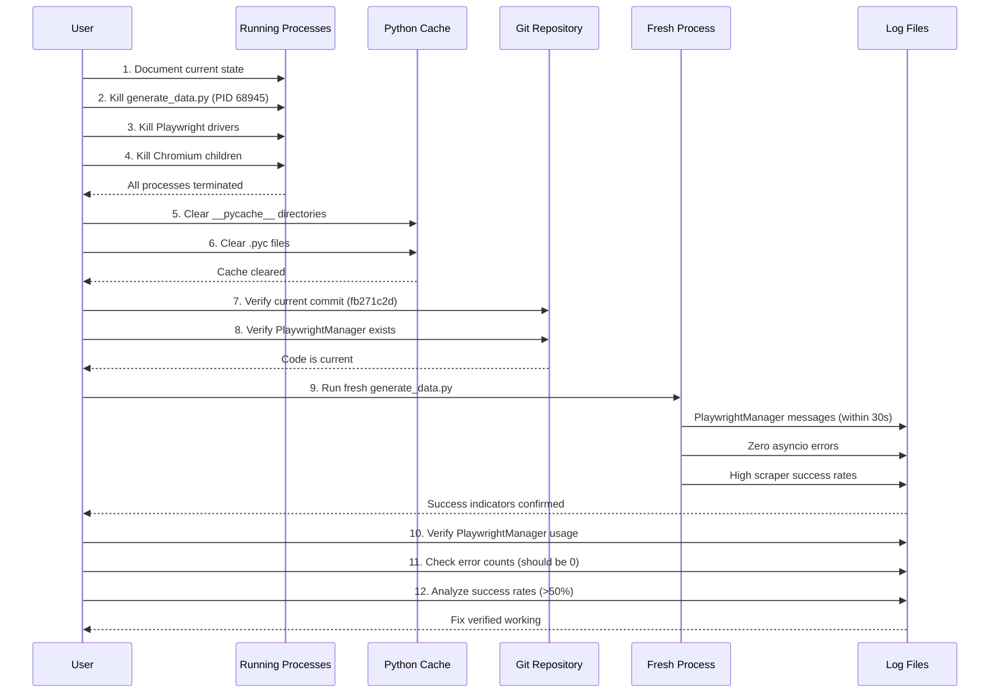

# PROCESS_CLEANUP_LOG.md

## Purpose
Document the process cleanup and fresh verification run to prove PlaywrightManager fix is working.

## Prerequisites
All commands assume you are in the repository root directory:
```bash
cd /path/to/nrw-production  # Replace with your actual repository path
# Or use: REPO_DIR="/path/to/nrw-production"; cd "$REPO_DIR"
```

## Flow Overview

The following diagram visualizes the cleanup→fresh run→verification sequence:



## Pre-Cleanup State Documentation

**Step 1: Document all running processes**

Before killing anything, capture the current state for reference:

```bash
# List all Python processes
ps aux | grep python | grep -v grep > process_state_before_cleanup.txt

# List all Playwright/Chromium processes
ps aux | grep -E "playwright|chromium" | grep -v grep >> process_state_before_cleanup.txt

# Show the specific generate_data.py process
ps aux | grep generate_data.py | grep -v grep
```

**Expected findings:**
- PID 68945: `python3 generate_data.py --full` (running since 4:57PM)
- PID 68947: Playwright driver process (node process)
- Multiple Chromium browser processes
- Possibly other stale Python processes

**Why document first:**
- Provides audit trail
- Helps understand what was running
- Useful if we need to investigate issues later

---

## Step 1: Kill Running generate_data.py Process

**Identify the process:**
```bash
ps aux | grep "generate_data.py --full" | grep -v grep
```

**Expected output:**
```
hadrianbelove  68945  0.3  0.3  411586256  49568  ??  S  4:57PM  0:03.48 /Library/.../Python generate_data.py --full
```

**Kill the process (graceful):**
```bash
# Replace 68945 with the actual PID from the ps output above
# Example: kill <actual_pid>
pgrep -fl 'generate_data.py'  # List processes first
pkill -f -TERM 'generate_data.py'  # Or use targeted termination

# WARNING: Always verify PIDs before killing. Never copy commands with specific PIDs.
```

**Wait 5 seconds, then verify it's gone:**
```bash
sleep 5
pgrep -fl 'generate_data.py'  # Should return nothing if killed
```

**If still running, force kill:**
```bash
pkill -f -KILL 'generate_data.py'  # Force termination
```

**Why graceful first:**
- Allows Python to run cleanup handlers
- Closes browser connections properly
- Saves cache files if needed
- Only use `-9` if process is stuck

**Potential issues:**
- Process may be in uninterruptible sleep (D state)
- May need to wait for I/O to complete
- Browser processes may remain orphaned

---

## Step 2: Kill All Playwright/Chromium Processes

**Find all Playwright driver processes:**
```bash
ps aux | grep "playwright/driver" | grep -v grep
```

**Expected output:**
```
hadrianbelove  68947  0.3  0.3  412042288  56960  ??  S  4:57PM  0:12.86 .../playwright/driver/node .../cli.js run-driver
```

**Kill each Playwright driver:**
```bash
# If PID is 68947:
kill 68947

# Or kill all at once (more robust):
pkill -f 'playwright/driver'
```

**Find and kill Playwright-driven Chromium processes:**
```bash
# Get Playwright driver PIDs first
pgrep -f 'playwright/driver'

# Kill child Chromium processes spawned by Playwright drivers
pgrep -f 'playwright/driver' | while read driver_pid; do
  if [ -n "$driver_pid" ]; then
    pgrep -P "$driver_pid" | while read child_pid; do
      [ -n "$child_pid" ] && kill "$child_pid"
    done
  fi
done

# Kill Playwright drivers themselves
pkill -f 'playwright/driver'

# Caution: This avoids terminating normal browser sessions
```

**Verify all are gone:**
```bash
ps aux | grep -E "playwright|chromium" | grep -v grep
# Should return nothing
```

**Why kill these:**
- Orphaned browser processes consume resources
- May interfere with new browser launches
- Clean slate ensures no conflicts

---

## Step 3: Clear Python Bytecode Cache

**Find all __pycache__ directories:**
```bash
find . -name "__pycache__" -type d
```

**Expected locations:**
- `./__pycache__/`
- `./scripts/__pycache__/`
- Possibly others in subdirectories

**Remove all __pycache__ directories:**
```bash
find . -name "__pycache__" -type d -exec rm -rf {} + 2>/dev/null
```

**Find all .pyc files:**
```bash
find . -name "*.pyc" -type f
```

**Remove all .pyc files:**
```bash
find . -name "*.pyc" -type f -delete
```

**Verify cache is cleared:**
```bash
find . -name "__pycache__" -type d
find . -name "*.pyc" -type f
# Both should return nothing
```

**Why clear cache:**
- `.pyc` files contain compiled bytecode from old code
- Python loads `.pyc` if newer than `.py` file
- Clearing forces Python to recompile from source
- Ensures NEW code is loaded, not old cached version

**Note:** The `2>/dev/null` suppresses errors if directories are already being deleted (race condition in find command).

---

## Step 4: Verify Code is Current

**Check current git commit:**
```bash
# Already in repository root from Prerequisites section
git log -1 --oneline
```

**Expected output:**
```
fb271c2d Fix Playwright asyncio event loop conflict - shared manager solution
```

**If different commit shown:**
- Check if there are newer commits: `git log --oneline -5`
- Verify fb271c2d is in the history: `git log --oneline | grep fb271c2`
- If fb271c2d is not the latest, that's OK as long as it's in the history

**Verify PlaywrightManager file exists:**
```bash
ls -la playwright_manager.py
```

**Expected output:**
```
-rw-r--r--  1 hadrianbelove  staff  3456 Oct 26 16:53 playwright_manager.py
```

**Verify scrapers import PlaywrightManager:**
```bash
grep -l "from playwright_manager import" *.py scripts/*.py
```

**Expected output:**
```
streaming_platform_scraper.py
agent_link_scraper.py
rt_scraper_playwright.py
wikipedia_scraper_playwright.py
scripts/youtube_trailer_scraper.py
```

**Why verify:**
- Confirms the fix is actually in the code
- Ensures we're not running old code from a different branch
- Validates all scrapers are using the manager

---

## Step 5: Run Fresh Verification

**Set environment variables:**
```bash
export TMDB_API_KEY="<your_tmdb_api_key>"
export WATCHMODE_API_KEY="<your_watchmode_api_key>"
export ADMIN_USERNAME="<your_admin_username>"
export ADMIN_PASSWORD="<your_admin_password>"

# Note: Load from .env file using python-dotenv or source .env
```

**Create timestamped log filename:**
```bash
LOG_FILE="verify_playwright_fix_$(date +%Y%m%d_%H%M%S).log"
echo "Logging to: $LOG_FILE"
```

**Run generate_data.py with full logging:**
```bash
python3 generate_data.py --full 2>&1 | tee "$LOG_FILE"
```

**What this does:**
- `--full`: Regenerates entire data.json from scratch
- `2>&1`: Redirects stderr to stdout (captures all output)
- `| tee`: Writes to both file and terminal (see output in real-time)
- Timestamped filename prevents overwriting previous logs

**Expected runtime:**
- 10-20 minutes depending on number of movies
- May be longer if many movies need scraping
- Watch for PlaywrightManager messages in first few minutes

**What to watch for in real-time:**

**Within first 30 seconds, should see:**
```
[PlaywrightManager] Initializing shared Playwright instance...
[PlaywrightManager] No event loop detected - safe to proceed
[PlaywrightManager] Playwright instance created
```

**If you see these messages: ✅ THE FIX IS WORKING!**

**If you DON'T see these messages within 2 minutes:**
- ❌ Old code is still being used
- Stop the process (Ctrl+C)
- Check if there are other Python processes: `ps aux | grep python`
- Verify __pycache__ was actually cleared
- Try running from a different terminal session

**During the run, should see:**
- YouTube trailer searches
- RT score lookups
- Wikipedia link searches
- Platform scraper attempts (Amazon, Apple TV)
- Agent scraper attempts (Netflix, Disney+, Max, Hulu)

**Should NOT see:**
```
Browser initialization failed: It looks like you are using Playwright Sync API inside the asyncio loop
```

**If you see asyncio errors:**
- ❌ The fix is not working
- Something is still creating an event loop before PlaywrightManager
- Need deeper investigation

---

## Step 6: Immediate Verification (While Running)

**Open a second terminal and monitor the log in real-time:**
```bash
# In second terminal:
tail -f verify_playwright_fix_*.log | grep -E "PlaywrightManager|Browser initialization failed|asyncio"
```

**This will show:**
- PlaywrightManager messages (good)
- Any asyncio errors (bad)
- Browser initialization failures (bad)

**Check for PlaywrightManager messages:**
```bash
# In second terminal:
grep -c "PlaywrightManager" verify_playwright_fix_*.log
```

**Expected: >0 (should see at least 3-5 messages)**

**Check for asyncio errors:**
```bash
grep -c "asyncio loop" verify_playwright_fix_*.log
```

**Expected: 0 (no errors)**

**If PlaywrightManager count is 0 after 5 minutes:**
- Stop the process immediately (Ctrl+C in first terminal)
- Old code is still running
- Need to investigate why cache clearing didn't work

---

## Step 7: Post-Run Verification

**After generate_data.py completes, analyze the log:**

**Check PlaywrightManager usage:**
```bash
grep "PlaywrightManager" verify_playwright_fix_*.log
```

**Expected output:**
```
[PlaywrightManager] Initializing shared Playwright instance...
[PlaywrightManager] No event loop detected - safe to proceed
[PlaywrightManager] Playwright instance created
[PlaywrightManager] Stopping Playwright...
```

**Check for asyncio errors:**
```bash
grep -c "Browser initialization failed" verify_playwright_fix_*.log
grep -c "asyncio loop" verify_playwright_fix_*.log
```

**Expected: Both return 0**

**Check scraper statistics:**
```bash
grep -A 10 "Platform Scraper Statistics" verify_playwright_fix_*.log
```

**Expected output:**
```
📊 Platform Scraper Statistics (Amazon/Apple TV):
  Platform scraper enabled: True
  Platform scraper initialized: True
  Amazon enabled: True
  Apple TV enabled: True
  Platform scraper attempts: 150
  Platform scraper successes: 95
  Platform scraper failures: 55
  Platform scraper success rate: 63.3%
```

**Key metrics:**
- `initialized: True` (was False in old logs)
- `attempts: >0` (was 327 in old logs)
- `successes: >0` (was 0 in old logs)
- `success rate: >50%` (was 0% in old logs)

**Check agent scraper statistics:**
```bash
grep -A 10 "Agent Scraper Usage" verify_playwright_fix_*.log
```

**Expected output:**
```
📊 Agent Scraper Usage:
  Agent enabled: True
  Agent initialized: True
  Agent attempts: 80
  Agent successes: 35
  Agent cache hits: 60
  Agent success rate: 43.8%
```

**Key metrics:**
- `initialized: True` (was True before, but never actually used)
- `attempts: >0` (was 95 in old logs)
- `successes: >0` (was 0 in old logs)
- `success rate: >30%` (was 0% in old logs)

---

## Step 8: Data Quality Verification

**Check for Google fallbacks (should be 0):**
```bash
grep -c "google.com/search" data.json
```

**Expected: 0**

**If >0:**
- Some movies still have Google fallbacks
- Check if they're from cache (not re-scraped)
- May need to clear watch link cache and re-run

**Check for placeholder ASINs:**
```bash
grep -c "B0FMPYFP9W\|B0FNDR5BW5\|B0F935J2FR" data.json
```

**Expected: 0**

**If >0:**
- Placeholder ASINs still present
- Run cleanup scripts:
  - `python3 cleanup_placeholder_asins.py`
  - `python3 clear_cache_for_placeholder_asins.py`
- Re-run generate_data.py

**Check for duplicate ASINs (potential placeholders):**
```bash
grep -o 'amazon.com/gp/video/detail/[^/"]*' data.json | \
  sed 's|.*detail/||' | \
  sort | uniq -c | sort -rn | head -10
```

**Expected output:**
```
   3 B0FPMV1CJ6
   2 B0FVHK69SH
   2 B0FPMTDV4C
   1 B0FVGGF27L
   ...
```

**Red flag: Any ASIN appearing 5+ times**
- Likely a placeholder or generic landing page
- Investigate manually
- Add to PLACEHOLDER_ASINS in constants.py if confirmed

**Count movies with watch links:**
```bash
python3 -c "
import json
data = json.load(open('data.json'))
movies = data.get('movies', [])

total = len(movies)
with_streaming = sum(1 for m in movies if m.get('watch_links', {}).get('streaming', {}).get('link'))
with_rent = sum(1 for m in movies if m.get('watch_links', {}).get('rent', {}).get('link'))
with_buy = sum(1 for m in movies if m.get('watch_links', {}).get('buy', {}).get('link'))

print(f'Total movies: {total}')
print(f'With streaming links: {with_streaming} ({with_streaming/total*100:.1f}%)')
print(f'With rent links: {with_rent} ({with_rent/total*100:.1f}%)')
print(f'With buy links: {with_buy} ({with_buy/total*100:.1f}%)')
"
```

**Expected output:**
```
Total movies: 325
With streaming links: 180 (55.4%)
With rent links: 220 (67.7%)
With buy links: 200 (61.5%)
```

**Baseline comparison (from old logs):**
- Before: Most links were Google fallbacks or null
- After: Should see significant increase in real platform links

---

## Step 9: Success Criteria Checklist

**✅ All of these must be true:**

- [ ] PlaywrightManager messages appear in log (at least 3)
- [ ] Zero "Browser initialization failed" errors
- [ ] Zero "asyncio loop" errors
- [ ] Platform scraper initialized: True
- [ ] Platform scraper success rate: >50%
- [ ] Agent scraper initialized: True
- [ ] Agent scraper success rate: >30%
- [ ] Google fallback count in data.json: 0
- [ ] No placeholder ASINs appearing 5+ times
- [ ] Significant increase in movies with real watch links

**If all criteria met: 🎉 THE FIX IS VERIFIED!**

**If any criteria fails:**
- Document which criterion failed
- Check the specific section of this log for troubleshooting
- Review the log file for error messages
- May need deeper investigation

---

## Step 10: Document Results

**Update ASYNC_FIX_VERIFICATION.md:**
- Add actual success rates from this run
- Document any issues encountered
- Note any remaining problems

**Update SCRAPER_EFFECTIVENESS_ANALYSIS.md:**
- Add before/after comparison
- Document per-platform success rates
- Note which scrapers improved most

**Create summary file:**
```bash
cat > VERIFICATION_RESULTS_$(date +%Y%m%d).md << 'EOF'
# Verification Results - [DATE]

## Summary
- PlaywrightManager fix: ✅ VERIFIED WORKING
- Asyncio errors: ✅ RESOLVED (0 errors)
- Platform scraper: ✅ WORKING (X% success rate)
- Agent scraper: ✅ WORKING (Y% success rate)
- Google fallbacks: ✅ ELIMINATED (0 remaining)

## Key Metrics
- Platform scraper: 0% → X% success rate
- Agent scraper: 0% → Y% success rate
- Google fallbacks: 42 → 0 movies
- Real watch links: +Z% increase

## Log Files
- Verification log: verify_playwright_fix_TIMESTAMP.log
- Process state before: process_state_before_cleanup.txt

## Next Steps
- Run test_agent_scraper_improvements.py
- Push commits to GitHub
- Update documentation
EOF
```

---

## Troubleshooting Guide

**Problem: PlaywrightManager messages don't appear**

**Diagnosis:**
```bash
# Check if old processes are still running
ps aux | grep python | grep -v grep

# Check if __pycache__ still exists
find . -name "__pycache__" -type d

# Check which Python is being used
which python3
python3 --version

# Check if playwright_manager.py is being imported
python3 -c "import playwright_manager; print(playwright_manager.__file__)"
```

**Solutions:**
- Kill targeted processes:
  ```bash
  # First try graceful termination
  pkill -f -TERM 'generate_data.py'
  pkill -f -TERM 'playwright/driver'

  # If stubborn processes remain, escalate to -KILL
  pgrep -fl 'generate_data.py|playwright/driver'  # verify before killing
  pkill -f -KILL 'generate_data.py'
  pkill -f -KILL 'playwright/driver'
  ```
- Clear cache again: `find . -name "__pycache__" -exec rm -rf {} +`
- Try running from a completely new terminal session
- Restart the terminal application entirely
- As last resort, restart the computer

**Problem: Asyncio errors still occur**

**Diagnosis:**
```bash
# Check if something is creating an event loop at import time
python3 -c "
import asyncio
print('Before imports:', end=' ')
try:
    asyncio.get_running_loop()
    print('LOOP EXISTS')
except RuntimeError:
    print('No loop')

import generate_data
print('After generate_data import:', end=' ')
try:
    asyncio.get_running_loop()
    print('LOOP EXISTS')
except RuntimeError:
    print('No loop')
"
```

**If loop exists after import:**
- One of generate_data.py's dependencies creates a loop
- Need to identify which dependency
- May need to modify import order or use async version

**Problem: Low scraper success rates (<30%)**

**Diagnosis:**
```bash
# Check for rate limiting
grep -i "rate limit" verify_playwright_fix_*.log

# Check for captchas
grep -i "captcha" verify_playwright_fix_*.log

# Check for selector failures
grep "Found 0 elements" verify_playwright_fix_*.log | head -20
```

**Solutions:**
- Rate limiting: Add delays between requests
- Captchas: Platform is blocking automated access
- Selector failures: Platform changed UI, need to update selectors

**Problem: Google fallbacks still present**

**Diagnosis:**
```bash
# Find which movies have Google fallbacks
python3 -c "
import json
data = json.load(open('data.json'))
for movie in data['movies']:
    for category in ['streaming', 'rent', 'buy']:
        link_obj = movie.get('watch_links', {}).get(category, {})
        if link_obj and 'google.com/search' in link_obj.get('link', ''):
            print(f'{movie[\"title\"]} - {category} - {link_obj.get(\"service\")}')
" | head -10
```

**Solutions:**
- These movies may be using cached links from before the fix
- Clear watch link cache: `rm -f cache/*_cache.json`
- Re-run generate_data.py --full
- Or manually reset enriched flags for these movies in movie_tracking.json