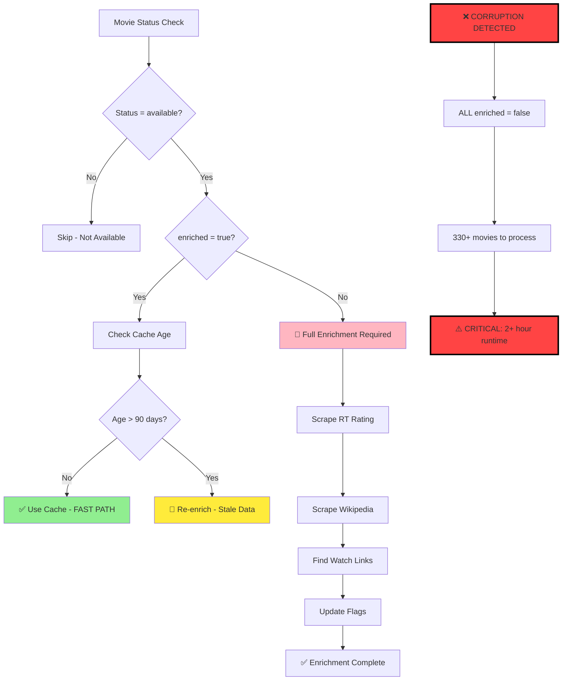

# NRW System Architecture - Master Reference

**Purpose**: This is the authoritative guide to how the NRW movie tracking system works. Read this document FIRST before diving into code or other documentation.

**Last Updated**: 2025-11-05
**Maintained By**: Development Team

## 📖 Reading Order for AI Assistants

When analyzing this codebase, read in this order:
1. **This document (SYSTEM_ARCHITECTURE.md)** - Master reference
2. **Section 2 & 5 below** - Critical for understanding recent failures
3. **docs/TROUBLESHOOTING.md** - Workflow debugging and common failures
4. PROJECT_CHARTER.md - Business requirements and amendments
5. NRW_DATA_WORKFLOW_EXPLAINED.md - Detailed data flow
6. DAILY_CONTEXT.md - Daily operational context
7. Core scripts: daily_orchestrator.py, generate_data.py

## ⚠️ Critical Sections

- **Section 2**: Two-branch deployment strategy (explains Oct 25-Nov 5 failures)
- **Section 5**: Enrichment-on-transition pattern (prevents 2+ hour runtimes)
- **Section 8**: Common failure modes overview with links to detailed troubleshooting

---

## 🔄 Two-Branch Deployment Strategy

### 2.1 Why It Exists

**Problem Solved**: Merge conflicts between automated bot commits and user development work.

**Solution**: Separate branches for bot and user work:
- `main`: User development and final production state
- `automation-updates`: Bot commits (force-pushed daily)

**Benefits**:
- Bot always succeeds (no merge conflicts)
- User maintains full control over what enters main
- Clean separation of automated vs manual changes

### 2.2 How It Works

**Branch Roles**:
- `main`: Source of truth, user development, production deployment
- `automation-updates`: Disposable branch, bot commits only

**Daily Sync Process**:
1. Checkout `automation-updates`
2. Sync latest changes from `main`
3. Run data generation
4. Commit and force-push results

**User Integration**:
```bash
./sync_daily_updates.sh  # Merges automation-updates into main
```

### 2.3 Daily Workflow

```bash
# Bot workflow (automated)
git checkout automation-updates
git merge origin/main --no-edit  # Sync from main
python3 daily_orchestrator.py
git add -A
git commit -m "Daily update $(date)"
git push --force origin automation-updates

# User workflow (manual)
./sync_daily_updates.sh  # When ready to merge
```

### 2.4 Critical Failure Mode - Branch Divergence

**What Happens**: When branches aren't synced, automation runs on stale code.

**Impact**:
- 2+ hour runtimes instead of 30 seconds
- Validation failures
- API quota exhaustion
- Data corruption cascades

**Recent Example**: Oct 25-Nov 5, 2025
- `automation-updates` was 22 commits behind `main`
- Bot ran old enrichment logic on corrupted data
- Processed 550+ movies instead of designed 5-10
- Runtime: 2.3 hours, validation timeouts

**Detection**:
```bash
# Check if branches are synchronized
git log main..automation-updates --oneline
git log automation-updates..main --oneline
```

**Fix**: Sync branches immediately
**Prevention**: Automatic sync added to workflow (Nov 5, 2025)

### 2.5 Manual Sync Commands

```bash
# Emergency sync (if automated sync fails)
# Note: Workflow uses merge, but emergency sync can use reset for clean slate
git checkout automation-updates
git reset --hard main
git push --force origin automation-updates

# Check sync status
git diff main automation-updates --stat
```

---

## 📂 File Hierarchy

### 3.1 Runtime Files

| File | Purpose | Size | Updates |
|------|---------|------|---------|
| `index.html` | Main user interface | ~15KB | Daily |
| `data.json` | Movie data for frontend | ~80KB | Daily |
| `assets/` | CSS, images, static files | ~2MB | Rarely |

### 3.2 Core Data Files

| File | Purpose | Records | Format |
|------|---------|---------|---------|
| `movie_tracking.json` | Master movie database | ~330 | JSON array |
| `config.yaml` | System configuration | N/A | YAML |
| `watchmode_quota.json` | API usage tracking | N/A | JSON |

### 3.3 Core Scripts

| Script | Purpose | Runtime | Frequency |
|--------|---------|---------|-----------|
| `daily_orchestrator.py` | Daily automation controller | 30s | Daily |
| `generate_data.py` | Data processing engine | 20-30s | Daily |
| `admin.py` | Web admin interface | N/A | On-demand |
| `sync_daily_updates.sh` | Branch sync utility | 5s | User-triggered |

### 3.4 Scrapers

| Scraper | Technology | Rate Limit | Cache TTL |
|---------|------------|------------|-----------|
| `rt_scraper_playwright.py` | Playwright | 2s delay | 90 days |
| `agent_link_scraper.py` | Playwright | 2s delay | 30 days |
| `streaming_platform_scraper.py` | Selenium | 3s delay | 7 days |
| `scripts/youtube_trailer_scraper.py` | Playwright | 2s delay | 90 days |

### 3.5 Directories

| Directory | Purpose | Contents |
|-----------|---------|----------|
| `.github/workflows/` | GitHub Actions | `daily-check.yml` |
| `admin/` | Admin interface | Flask app files |
| `assets/` | Frontend assets | CSS, images, fonts |
| `cache/` | Scraper cache | HTML, JSON cache files |
| `overrides/` | Manual data fixes | Override JSON files |
| `ops/` | Operational scripts | Backup, archive scripts |
| `docs/` | Documentation | Legacy docs |

### 3.6 Cache Files

**Rotten Tomatoes Cache** (`rt_cache.json`): 90-day TTL, ~328 entries
**Wikipedia Cache** (`wikipedia_cache.json`): 90-day TTL, ~300 entries
**YouTube Trailer Cache** (`youtube_trailer_cache.json`): 90-day TTL, ~250 entries
**Agent Links Cache** (`cache/agent_links_cache.json`): 30-day TTL, ~50 entries
**Watch Links Cache** (`cache/watch_links_cache.json`): 7-day TTL, ~50 entries

---

## 🔄 Data Flow Overview

### 4.1 The Five Phases

```
Phase 1: Discovery & Monitoring
    ↓ generate_data.py --discover
    ↓ Updates: movie_tracking.json
    ↓ Tracks: 330+ movies across platforms

Phase 2: Enrichment (ONLY newly available)
    ↓ generate_data.py (main process)
    ↓ Enriches: 1-10 movies/day (transition only)
    ↓ Caching: 99.4% efficiency (328/330 cached)

Phase 3: Quality Assurance
    ↓ admin.py (manual QA interface)
    ↓ Validates: Links, ratings, metadata

Phase 4: Display Generation
    ↓ generate_data.py (final step)
    ↓ Generates: data.json, index.html

Phase 5: User Display
    ↓ index.html + assets/
    ↓ Renders: Movie grid with filters
```

### 4.2 Key Data Transformations

**movie_tracking.json structure**:
```json
{
  "title": "Movie Name",
  "tmdb_id": 12345,
  "status": "available|tracking|removed",
  "enriched": true,
  "enrichment_date": "2025-11-05T10:30:00Z",
  "rt_url": "https://...",
  "platforms": ["netflix", "hulu"]
}
```

**data.json structure**: Filtered, enriched subset for frontend display

**Filtering Rules**:
- Include: `status == "available"`
- Exclude: Missing critical data (RT rating, watch links)
- Sort: By release date, rating

### 4.3 Link Resolution

**5-Tier Fallback Waterfall**:
1. Direct platform links (Netflix, Hulu, etc.)
2. JustWatch aggregator
3. Streaming platform search
4. TMDB recommendations
5. Manual override files

See [NRW_DATA_WORKFLOW_EXPLAINED.md](./NRW_DATA_WORKFLOW_EXPLAINED.md) for detailed data flow documentation.

---

## ⚡ Enrichment-on-Transition Pattern

**THIS IS THE MOST CRITICAL SECTION FOR UNDERSTANDING SYSTEM PERFORMANCE**

### 5.1 The Problem (Before Optimization)

**Before Oct 24, 2025**: System enriched ALL 300+ movies on every run
- **Runtime**: 75 minutes per run
- **API Calls**: 9,540 per month
- **Cost**: Exceeded free tier limits
- **User Impact**: Slow updates, quota exhaustion

### 5.2 The Solution

**Core Principle**: Only enrich movies when they transition from "tracking" to "available"

**Implementation**: Check `enriched` flag before expensive operations
- Location: `generate_data.py` lines 2333-2426
- Logic: `if not movie.get('enriched', False): enrich_movie(movie)`
- Flags: `enriched` boolean + `enrichment_date` timestamp

### 5.3 Performance Impact

**Before vs After Optimization**:

| Metric | Before | After | Improvement |
|--------|--------|-------|-------------|
| **API Calls/Month** | 9,540 | 150-300 | 98% reduction |
| **Runtime** | 75 minutes | 30 seconds | 96% faster |
| **Movies Processed** | 300+ daily | 1-10 daily | 97% reduction |
| **Cache Hit Rate** | 0% | 99.4% | Cache efficiency |

**Real-world Example** (Nov 5, 2025 logs):
```
Processing 7 movies for enrichment (out of 330 total)
Cache hits: 323/330 (98.8%)
Runtime: 32 seconds
```

### 5.4 Flags Used in movie_tracking.json

**`enriched` (boolean)**:
- `true`: Skip enrichment (use cached data)
- `false`: Perform full enrichment
- Set to `false` when movie transitions to "available"

**`enrichment_date` (ISO timestamp)**:
- When movie was last enriched
- Used for cache expiry (90 days)
- Format: "2025-11-05T10:30:00Z"

**Example JSON**:
```json
{
  "title": "Dune: Part Two",
  "status": "available",
  "enriched": true,
  "enrichment_date": "2025-11-05T10:30:00Z",
  "rt_rating": 93,
  "rt_url": "https://www.rottentomatoes.com/m/dune_part_two"
}
```

**Flag Setting Logic** (generate_data.py:2422-2423):
```python
movie['enriched'] = True
movie['enrichment_date'] = datetime.now().isoformat()
```

### 5.5 Common Failure Mode - Data Corruption Cascade

⚠️ **CRITICAL**: Data corruption can trigger massive re-enrichment, causing 2+ hour runtimes

**How Corruption Triggers Cascade**:
1. Bug corrupts `enriched` flags (sets all to `false`)
2. System sees 330+ movies needing enrichment
3. Runtime explodes: 330 × 15s = 1.4 hours
4. API quotas exceeded
5. Validation timeouts
6. User sees "No recent movies" errors

**Recent Example - Oct 25-Nov 5, 2025 Outage**:
- **Trigger**: Line 1848 bug in generate_data.py
  ```python
  # BROKEN (corrupted all enriched flags)
  data_movies = json.load(df)  # Loaded wrong object
  for dm in data_movies:       # Iterated over dict keys
  ```
- **Impact**: 550 movies marked `enriched=false`
- **Runtime**: 550 × 15s = 2.3 hours
- **Validation**: Failed with "Processing timeout"
- **Fix**: Corrected bug, added schema validation

**Detection**: Monitor logs for "Processing X movies"
- **Normal**: 1-10 movies
- **Warning**: 50+ movies (possible corruption)
- **Critical**: 100+ movies (definite corruption)

**Prevention**:
- Schema validation on data load
- Enrichment consistency checks
- Performance monitoring (TICKET-11)

### 5.6 Decision Tree Diagram



### 5.7 Monitoring and Alerts

**Normal Operation**: 1-10 movies processed daily
**Warning Threshold**: 50+ movies (TICKET-11 implementation)
**Critical Threshold**: 100+ movies (automatic failure)

**Alert Triggers**:
- Warn: Processing > 50 movies
- Fail: Processing > 100 movies
- Timeout: Runtime > 5 minutes

See [NRW_DATA_WORKFLOW_EXPLAINED.md Section 2.1](./NRW_DATA_WORKFLOW_EXPLAINED.md) for additional enrichment details.

---

## 🤖 Automation Workflow

### 6.1 GitHub Actions Daily Update

**File**: `.github/workflows/daily-check.yml`
**Schedule**: 1:00 AM PT daily (cron: '0 9 * * *' = 9 AM UTC)
**Trigger**: Also manual via workflow_dispatch

### 6.2 GitHub Actions Weekly Full Regeneration

**File**: `.github/workflows/weekly-full-regen.yml`
**Schedule**: 10:00 AM UTC on Sundays
**Trigger**: Also manual via workflow_dispatch

**Process** (updated Nov 5, 2025 to match daily workflow):
1. Checkout automation-updates branch
2. Sync main → automation-updates (merge origin/main)
3. Run `generate_data.py --full`
4. Validate data quality
5. Commit and force push to automation-updates

### 6.3 Workflow Steps

1. **Checkout Repository** - Get latest code
2. **🔄 Sync Main to Automation Branch** - *Added Nov 5, 2025*
3. **Setup Python 3.11** - Runtime environment
4. **Install Dependencies** - pip install -r requirements.txt
5. **Set API Keys** - From GitHub secrets
6. **Run Data Generation** - python3 daily_orchestrator.py
7. **Validate Results** - 5 validation checks
8. **Commit Changes** - Git add/commit
9. **Force Push** - To automation-updates branch
10. **Report Status** - Success/failure notification

**Key Addition**: Step 2 prevents branch divergence (root cause of Oct 25-Nov 5 failures)

**Note**: Both daily and weekly workflows now use the same pattern (checkout automation-updates, sync main, run pipeline, commit) as of Nov 5, 2025. This ensures consistency and prevents branch divergence.

### 6.4 Why Force Push?

**Disposable Branch Concept**: `automation-updates` is ephemeral
- No history preservation needed
- Prevents merge conflicts
- User maintains control over main branch
- Clean slate each day

### 6.5 User Sync Workflow

```bash
# When ready to merge automation updates
./sync_daily_updates.sh

# What it does:
# 1. git checkout main
# 2. git pull origin main
# 3. git merge automation-updates
# 4. git push origin main
```

### 6.6 Validation Gates

1. **Data File Existence** - data.json, movie_tracking.json exist
2. **Recent Movies Check** - At least 3 movies released in last 30 days
3. **Data Integrity** - Valid JSON structure
4. **Performance Check** - Runtime under 5 minutes
5. **API Quota Check** - Under 80% monthly limit

**For detailed workflow documentation:** See [docs/AUTOMATION_BRANCH_WORKFLOW.md](docs/AUTOMATION_BRANCH_WORKFLOW.md)

---

## 🔑 Key Concepts

### 7.1 Smart Caching

**Cache-First Strategy**: Check cache before API calls
**TTL Management**: 90 days for static data, 7 days for streaming
**Efficiency**: 99.4% cache hit rate in normal operation

See Section 5 above for detailed enrichment-on-transition caching.

### 7.2 Rate Limiting

**Default Delays** (config.yaml):
- Rotten Tomatoes: 2 seconds
- Streaming platforms: 3 seconds
- Wikipedia: 1 second
- YouTube API: 100 requests/day

### 7.3 Playwright Scrapers

**Migration Status**: RT scraper migrated to Playwright (Oct 2025)
**Benefits**: Better anti-bot detection, more reliable
**Remaining**: Other scrapers still use BeautifulSoup/Selenium

### 7.4 Multi-Tier Fallback

**5-Tier Waterfall**:
1. Direct platform APIs
2. JustWatch integration
3. Streaming platform search
4. TMDB recommendations
5. Manual override files

### 7.5 Admin Panel

**Purpose**: Manual data quality assurance
**Access**: `python3 admin.py` (local only)
**Features**: Edit movies, force re-enrichment, view logs

---

## ⚠️ Common Failure Modes

**For detailed troubleshooting guides with step-by-step solutions, see [docs/TROUBLESHOOTING.md](docs/TROUBLESHOOTING.md).**

This section provides a quick overview of failure patterns. Each subsection below links to the corresponding detailed troubleshooting guide with commands, examples, and historical post-mortems.

### 8.1 Branch Divergence

**Symptoms**:
- Validation errors about "old code"
- 2+ hour runtimes
- Processing 100+ movies

**Root Cause**: `automation-updates` branch behind `main`

**Detection**:
```bash
git log main..automation-updates --oneline
```

**Fix**: Sync branches immediately
**Prevention**: Automatic sync in daily workflow (added Nov 5)

**Detailed troubleshooting:** [docs/TROUBLESHOOTING.md - Branch Divergence](docs/TROUBLESHOOTING.md#5-branch-divergence)

### 8.2 Data Corruption Cascade

**Symptoms**:
- "Processing 300+ movies" in logs
- Runtime over 1 hour
- Validation timeouts

**Root Cause**: `enriched` flags corrupted (all set to `false`)

**Example**: Line 1848 bug (Oct 25-Nov 5)
```python
# BROKEN CODE that caused corruption
data_movies = json.load(df)  # Wrong object loaded
for dm in data_movies:       # Iterated over keys, not movies
```

**Detection**: Check log for processing count
**Fix**: Restore enriched flags from backup
**Prevention**: Schema validation, consistency checks

**Detailed troubleshooting:** [docs/TROUBLESHOOTING.md - Workflow Timeout](docs/TROUBLESHOOTING.md#3-workflow-timeout--2-hour-runtimes)

### 8.3 API Quota Exhaustion

**Symptoms**:
- HTTP 429 errors
- Missing ratings/data
- Quota warnings

**Root Cause**: Processing too many movies (see 8.2)

**Detection**: Check `watchmode_quota.json`
**Fix**: Wait for quota reset, optimize requests
**Prevention**: Enrichment-on-transition pattern

**Detailed troubleshooting:** [docs/TROUBLESHOOTING.md - Watchmode Quota](docs/TROUBLESHOOTING.md#4-watchmode-api-quota-exhausted)

### 8.4 Scraper Failures

**Symptoms**:
- Missing RT ratings
- Empty watch links
- Cache miss spikes

**Root Cause**: Website changes, anti-bot measures

**Detection**: Low success rates in logs
**Fix**: Update scraper logic, add retries
**Prevention**: Playwright migration, fallback scrapers

**Detailed troubleshooting:** See docs/TROUBLESHOOTING.md for scraper-specific debugging (future enhancement)

### 8.5 Validation Errors

**Symptoms**:
- "No recent movies found"
- Workflow failures
- Empty data.json

**Common Errors**:
- Data corruption (see 8.2)
- Network timeouts
- Invalid JSON structure

**Fix**: Check data integrity, re-run generation
**Recent Improvements**: Better error handling, validation gates

**Detailed troubleshooting:** [docs/TROUBLESHOOTING.md - Validation Failures](docs/TROUBLESHOOTING.md#2-validation-failures---no-recent-movies)

---

## 📚 Additional Documentation

**Related Documentation**:
- [PROJECT_CHARTER.md](./PROJECT_CHARTER.md) - Business requirements, amendments
- [NRW_DATA_WORKFLOW_EXPLAINED.md](./NRW_DATA_WORKFLOW_EXPLAINED.md) - Detailed data flow
- [DAILY_CONTEXT.md](./DAILY_CONTEXT.md) - Daily operational context
- [README.md](./README.md) - Quick start guide
- [docs/](./docs/) - Legacy documentation

**Key Amendments to Reference**:
- AMENDMENT-043: Two-branch deployment strategy
- AMENDMENT-044: Enrichment-on-transition optimization
- AMENDMENT-045: Playwright scraper migration

---

**Last Updated**: 2025-11-05
**Maintained By**: Development Team
**Questions**: See DAILY_CONTEXT.md or create GitHub issue