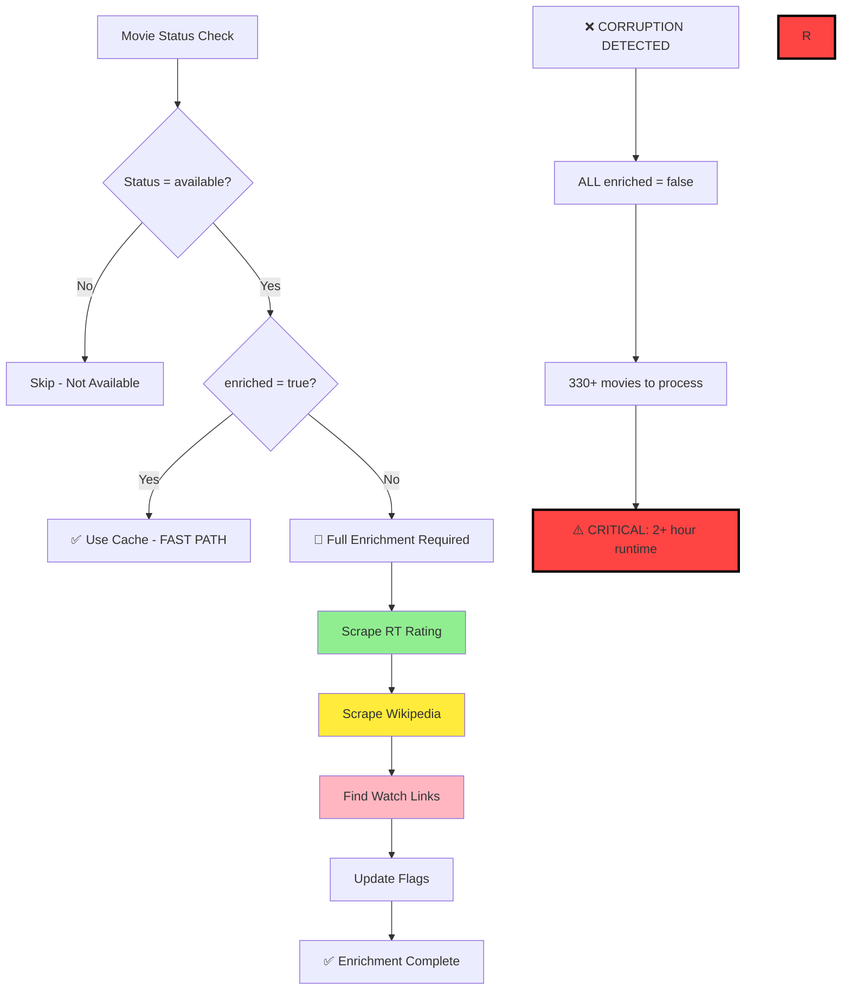

# NRW System Architecture - Master Reference

**Purpose**: This is the authoritative guide to how the NRW movie tracking system works. Read this document FIRST before diving into code or other documentation.

**Last Updated**: 2025-12-28
**Maintained By**: Development Team

## 📖 Reading Order for AI Assistants

When analyzing this codebase, read in this order:
1. **This document (SYSTEM_ARCHITECTURE.md)** - Master reference
2. **Section 2 & 5 below** - Critical for understanding recent failures
3. **docs/TROUBLESHOOTING.md** - Workflow debugging and common failures
4. PROJECT_CHARTER.md - Business requirements and amendments
5. NRW_DATA_WORKFLOW_EXPLAINED.md - Detailed data flow
6. Core scripts: daily_orchestrator.py, generate_data.py
7. Recent git commits and metrics files for current system state

## ⚠️ Critical Sections

- **Section 1.1**: Core Data Model (append-only data.json)
- **Section 2**: Branch strategy with single-branch daily workflow
- **Section 5**: Enrichment-on-transition pattern (prevents 2+ hour runtimes)
- **Section 8**: Common failure modes overview with links to detailed troubleshooting

---

## 🎯 Core Data Model: The New Release Wall

### 1.1 What This System Does

**The New Release Wall tracks when movies become available for digital streaming/rental.**

The core problem: When a movie leaves theaters, there's no single source that tells you "this movie is now available on Netflix" or "you can now rent this on Amazon." TMDB's provider API tells you what's *currently* available, but not *when* it became available.

**Our solution:**
1. **Intake**: Continuously ingest new theatrical releases into a tracking database
2. **Discovery**: Poll all tracked movies daily to detect when they appear on streaming platforms
3. **Record**: When found, record the transition date and write to the display database
4. **Enrich**: Add metadata (RT scores, trailers, watch links) to make the display useful
5. **Display**: Show users a chronological wall of newly available movies

**The result**: An ongoing, accumulating database of digital release dates that no one else tracks.

### 1.2 The Append-Only Principle

**data.json is append-only.** Movies are added when discovered and NEVER deleted.

```
┌─────────────────────────────────────────────────────────────────────┐
│                     APPEND-ONLY DATA MODEL                          │
├─────────────────────────────────────────────────────────────────────┤
│                                                                     │
│  DISCOVERY PHASE                        ENRICHMENT PHASE            │
│  ───────────────                        ─────────────────           │
│                                                                     │
│  1. Find movie transitioning            4. Read enrichment queue    │
│     to "available" status                  (newly_available.json)   │
│                    │                                │               │
│                    ▼                                ▼               │
│  2. IMMEDIATELY write minimal    ──►   5. Fetch RT, Wikipedia,      │
│     entry to data.json                    trailers, watch links     │
│     (title, date, poster)                          │                │
│                    │                                ▼               │
│                    ▼                    6. OVERLAY enriched data    │
│  3. Add movie ID to enrichment            onto EXISTING entry       │
│     queue (newly_available.json)          in data.json              │
│                                                                     │
├─────────────────────────────────────────────────────────────────────┤
│  KEY INVARIANTS:                                                    │
│  • Movies are ADDED to data.json, never deleted                     │
│  • Enrichment OVERLAYS data, never recreates entries                │
│  • Each movie gets ONE enrichment attempt on transition day         │
│  • Queue resets daily - no accumulation across days                 │
└─────────────────────────────────────────────────────────────────────┘
```

### 1.2 Why Append-Only?

1. **No Data Loss**: A discovered movie is always visible, even if enrichment fails
2. **Predictable Behavior**: Users see movies immediately upon availability
3. **Simple Mental Model**: Discovery adds, enrichment enhances - nothing deletes
4. **No Cascade Failures**: Enrichment problems can't cause movies to disappear

### 1.3 The Two Key Files

| File | Role | When Written | Can Delete Movies? |
|------|------|--------------|-------------------|
| `data.json` | Display data for frontend | Discovery + Enrichment | **NO - append-only** |
| `metrics/newly_available.json` | Today's enrichment queue | Discovery phase | N/A (just IDs) |

### 1.4 Movie Lifecycle

```
INTAKE → TRACKING → DISCOVERY → data.json (minimal) → ENRICHMENT → data.json (full)
                         │                                   │
                         │                                   │
                         └── Movie visible immediately ──────┘
```

**Stage 1: Intake** - New theatrical releases added to movie_tracking.json with `status: "tracking"`

**Stage 2: Discovery** - When providers found, movie transitions to `status: "available"`:
- Minimal entry written to data.json IMMEDIATELY
- Movie ID added to enrichment queue

**Stage 3: Enrichment** - ONE attempt to add RT scores, Wikipedia, trailers, watch links:
- Reads queue, overlays data onto existing entries
- Success or failure, movie remains in data.json
- Queue resets next day (no retries)

---

## 🔄 Branch Strategy

### 2.1 Single-Branch Daily Workflow (Default)

**Current Implementation**: The daily CI workflow operates on a single-branch model for simplicity.

**Daily Workflow**:
1. Checkout `main` branch
2. Run daily pipeline directly on `main`
3. Commit and push changes to `main`

**Benefits**:
- Simplified workflow with no branch synchronization
- Immediate updates to main branch
- No merge conflicts between branches


### 2.2 Current Daily Workflow

```bash
# Bot workflow (automated) - Single branch
git checkout main
python3 daily_orchestrator.py
git add -A
git commit -m "Daily update $(date)"
git push origin main
```

---

## 📂 File Hierarchy

### 3.1 Runtime Files

| File | Purpose | Size | Updates |
|------|---------|------|---------|
| `index.html` | Main user interface | ~15KB | Daily |
| `data.json` | Movie data for frontend (minimal + enriched) | ~80KB | Daily |
| `assets/` | CSS, images, static files | ~2MB | Rarely |

### 3.2 Core Data Files

| File | Purpose | Records | Format |
|------|---------|---------|---------|
| `movie_tracking.db` | Master movie database (SQLite, gitignored) | 17,000+ | SQLite |
| `movie_tracking.json` | Daily Git export of `movie_tracking.db` — NOT the source of truth | 17,000+ | JSON object |
| `data.json` | Display data (append-only, 90-day window) | ~230 | JSON object |
| `metrics/newly_available.json` | Today's enrichment queue | Variable (0-20/day) | JSON object |
| `config.yaml` | System configuration | N/A | YAML |
| `cache/watch_links_cache.json` | Watch links cache | ~200 entries | JSON |

### 3.3 Core Scripts

| Script | Purpose | Runtime | Frequency |
|--------|---------|---------|-----------|
| `daily_orchestrator.py` | Daily automation controller | 30s | Daily |
| `generate_data.py` | Data processing engine | 20-30s | Daily |
| `admin.py` | Web admin interface | N/A | Via `./launch_all.sh` |

### 3.3a Pipeline Modules

| Module | Purpose | Lines | Status |
|--------|---------|-------|--------|
| `pipeline/context.py` | Shared `PipelineContext` dataclass (config, logger, storage, enrichment, tmdb_key) | 20 | ✅ Production |
| `pipeline/intake.py` | TMDB intake — new premieres, miniseries, festival backfill | 987 | ✅ Production |
| `pipeline/discoverer.py` | Provider discovery — JustWatch availability, gap-fill, pre-order detection | 1,076 | ✅ Production |
| `pipeline/enricher.py` | Metadata enrichment — scores, watch links, trailers, Wikipedia, RT | 1,291 | ✅ Production |
| `pipeline/enrichment.py` | Watch link discovery service (JustWatch client, provider mapping) | 1,658 | ✅ Production |
| `pipeline/storage.py` | File I/O operations, atomic writes, backups, retention policy | 657 | ✅ Production |
| `pipeline/validation.py` | Schema validation, consistency checks | 439 | ✅ Production |

**Modularization Progress:** Two-phase extraction from the original monolith
- **Phase 1 (Nov 2025):** Extracted services — Storage, Validation, Enrichment (watch link client)
- **Phase 2 (May 2026):** Extracted domain logic — Intake, Discovery, Enrichment (metadata)
- **Before:** 6,076 lines in `generator.py`
- **After:** 2,858 lines in `generator.py` (coordinator + display + utilities) + 7 focused modules
- `DataGenerator` keeps thin wrapper methods that delegate to extracted modules — no caller changes needed
- **See:** [docs/pipeline_extraction_2025-11-10/](docs/pipeline_extraction_2025-11-10/) for Phase 1 documentation

### 3.4 Scrapers

| Scraper | Technology | Rate Limit | Cache TTL |
|---------|------------|------------|-----------|
| `rt_scraper_playwright.py` | Playwright | 2s delay | 90 days |
| `wikipedia_scraper_playwright.py` | 4-tier waterfall | 1s delay | 90 days |
| `agent_link_scraper.py` (VOD scraper) | Playwright | 2s delay | 30 days |
| `streaming_platform_scraper.py` (Streamer scraper) | Playwright | 3s delay | 7 days |
| `scripts/youtube_trailer_scraper.py` (Trailer scraper) | Playwright | 2s delay | 90 days |

### 3.5 Directories

| Directory | Purpose | Contents |
|-----------|---------|----------|
| `.github/workflows/` | GitHub Actions | `daily-check.yml` |
| `admin/` | Admin interface | Flask app files |
| `assets/` | Frontend assets | CSS, images, fonts |
| `cache/` | Scraper cache | HTML, JSON cache files |
| `overrides/` | Manual data fixes | Override JSON files |
| `ops/` | Operational scripts | Backup, archive scripts |
| `docs/` | Documentation | Legacy docs |

### 3.6 Cache Files

**Rotten Tomatoes Cache** (`cache/rt_cache.json`): 90-day TTL, ~328 entries
**Wikipedia Cache** (`cache/wikipedia_cache.json`): 90-day TTL, ~300 entries
**YouTube Trailer Cache** (`cache/youtube_trailer_cache.json`): 90-day TTL, ~250 entries
**Agent Links Cache** (`cache/agent_links_cache.json`): 30-day TTL, ~50 entries
**Watch Links Cache** (`cache/watch_links_cache.json`): 7-day TTL, ~50 entries

---

## ⚙️ Configuration & Secrets

### 4.1 Configuration Pattern

All API keys follow the 12-factor app pattern:
1. **Environment variables** (production, CI/CD) - highest priority
2. **config.yaml** (local development only) - fallback
3. **Error if neither is set** - fail fast with clear message

### 4.2 API Keys & Secrets

**Required for Production:**
- `TMDB_API_KEY` - The Movie Database API key
- `OMDB_API_KEY` - OMDb API key (used for IMDb ID fallback in Wikipedia lookup)

> **Note (Mar 2026):** Watch links use cache + Playwright scrapers for Amazon/Apple TV deep links. Speculative scraping tries both platforms for ALL movies regardless of TMDB provider data.

**Launch Method:**
- `./launch_all.sh` - launches both admin panel (5556) and public site (3000)
- Background admin + foreground site, single command operation
- No authentication required for local development

**Local Development:**
See `config.yaml` for local development configuration. Replace placeholder values with real API keys. Never commit real keys to version control.

### 4.3 config.yaml Structure

```yaml
api:
  tmdb_api_key: ""  # TMDB API key (can be set via TMDB_API_KEY env var)
  tmdb_rate_limit: 0.1  # Seconds between API calls
  max_retries: 3

workflow:
  daily_check_time: "02:00"  # 2 AM PST
  weekly_bootstrap_day: "sunday"

display:
  days_back: 90  # Show movies from last N days
  min_movies: 20  # Minimum movies to display
  max_movies: 100  # Maximum movies to display

tracking:
  bootstrap_days: 7  # Look back N days for new releases
  check_interval_hours: 24  # How often to check

intake:     # Intake configuration (renamed from 'discovery' for clarity)
  max_pages: 10  # Maximum TMDB pages to process during intake
  days_back: 30  # Intake window for finding new premieres
  min_movies: 5  # Minimum movies to intake per run
  timeout: 30    # API timeout in seconds

agent_scraper:
  enabled: true
  headless: true
  rate_limit: 2.0
  timeout: 10
  max_retries: 3
  cache_ttl_days: 30
  screenshots_enabled: true
  screenshot_retention_days: 7

rt_scraper:
  enabled: true
  headless: true
  rate_limit: 2.0
  timeout: 10
  max_retries: 1
  cache_ttl_days: 90
```

### 4.4 Cache Strategies

**Rotten Tomatoes Cache** (`cache/rt_cache.json`): 90-day TTL, ~328 entries
**Wikipedia Cache** (`cache/wikipedia_cache.json`): 90-day TTL, ~300 entries
**YouTube Trailer Cache** (`cache/youtube_trailer_cache.json`): 90-day TTL, ~250 entries
**Agent Links Cache** (`cache/agent_links_cache.json`): 30-day TTL, ~50 entries
**Watch Links Cache** (`cache/watch_links_cache.json`): 7-day TTL, ~50 entries

**Cache Efficiency**: 99.4% hit rate in normal operation, prevents API quota exhaustion.

**Cache Strategy Per Component**:
- **Static data (RT ratings, Wikipedia)**: 90-day TTL
- **Dynamic streaming links**: 7-day TTL (faster platform changes)
- **Video trailers**: 90-day TTL (YouTube source URLs cached; trailers are downloaded and self-hosted as MP4s — see [docs/features/TRAILER_HOSTING.md](docs/features/TRAILER_HOSTING.md))
- **Agent scraping results**: 30-day TTL (balance between performance and freshness)

## 🌐 External APIs & Rate Limits

**Full API documentation:** [docs/features/API_REFERENCE.md](docs/features/API_REFERENCE.md)

| API | Key Required | Rate Limit | Usage |
|-----|--------------|------------|-------|
| TMDB | Yes (`TMDB_API_KEY`) | 40/10s | Movie metadata |
| Playwright Scrapers | No | 2s delay | Watch links (Amazon/Apple TV) |
| OMDb | Yes (`OMDB_API_KEY`) | 1000/day | IMDb ID fallback |
| Agent Scraping | No | 2s delay | Platform deep links |

## 🔗 Watch Links Schema & Cache

### Canonical Watch Links Schema

**Official Structure (as defined in [PROJECT_CHARTER.md](PROJECT_CHARTER.md)):**

The `watch_links` field in `data.json` uses a **two-category structure** representing different access methods:

```json
{
  "watch_links": {
    "streaming": {
      "service": "Netflix",
      "link": "https://www.netflix.com/title/12345"
    },
    "vod": {
      "service": "Amazon",
      "link": "https://www.amazon.com/..."
    }
  }
}
```

### Category Definitions
- **`streaming`**: Subscription-based services (Netflix, Prime, Disney+, HBO Max, Hulu, MUBI, Criterion)
- **`vod`**: Video on Demand - rental and purchase options (Amazon, Apple TV, Google Play, Vudu, Microsoft Store)

### Schema Rules
1. **Optional categories**: Only present when available for the movie (sparse structure)
2. **Required fields per category**: `service` (string, provider name) and `link` (string URL or null)
3. **Null links allowed**: `link: null` indicates service is available but URL not found (frontend shows error state)
4. **No search URLs**: System returns `null` instead of Google/Amazon search fallbacks (curator can add overrides)
5. **Service priority**: Best service selected per category (Netflix > Disney+ for streaming, Amazon > Apple TV for vod)

### Cache Strategy
- **Location:** `cache/watch_links_cache.json`
- **Key:** TMDB ID (string)
- **Value:** `{links: {...}, cached_at: ISO-8601, source: 'legacy_cache'|'agent_search'|'tmdb_providers'}`
- **Purpose:** Prevents redundant scraper calls
- **Effectiveness:** Cached links avoid re-scraping for known movies
- **Schema:** Uses canonical `streaming`/`vod` format (legacy `rent`/`buy` deprecated Dec 2024)

## 📊 Data Contracts

### movie_tracking.db / movie_tracking.json Schema

> The source of truth is `movie_tracking.db` (SQLite, via `pipeline/tracking_db.py`).
> `movie_tracking.json` is a daily export — never read it directly in code.

```json
{
  "title": "Movie Name",
  "tmdb_id": 12345,
  "status": "available|tracking|removed",
  "enriched": true,
  "enrichment_date": "2025-11-05T10:30:00Z",
  "digital_date": "2025-10-15",
  "rt_url": "https://...",
  "rt_rating": 85,
  "platforms": ["netflix", "hulu"],
  "manually_corrected": true,
  "manual_rt_score": true,
  "last_manual_edit": "2025-10-19T..."
}
```

### data.json Schema

Filtered, enriched subset for frontend display:

```json
{
  "tmdb_id": 12345,
  "imdb_id": "tt1234567",
  "title": "Movie Title",
  "original_title": "Original Title",
  "original_language": "en",
  "digital_date": "2025-10-15",
  "poster": "https://image.tmdb.org/...",
  "crew": {
    "director": "Director Name",
    "cast": ["Actor 1", "Actor 2"]
  },
  "synopsis": "Movie description...",
  "metadata": {
    "runtime": 120
  },
  "links": {
    "trailer_hosted": "https://f004.backblazeb2.com/file/NRW-TRAILERS/12345.mp4",
    "trailer": "https://youtube.com/...",
    "rt": "https://rottentomatoes.com/...",
    "wikipedia": "https://en.wikipedia.org/..."
  },
  "watch_links": {
    "streaming": {"service": "Netflix", "link": "https://..."},
    "vod": {"service": "Amazon", "link": "https://..."}
  },
  "_discovered_at": "2025-12-17T10:30:45Z",
  "_discovery_source": "apple_itunes",
  "_enrichment_status": "completed",
  "_minimal_entry": false,
  "_tmdb_fetch_failed": false
}
```

**Note**: Underscore-prefixed metadata fields (`_discovered_at`, `_enrichment_status`, etc.) are added during December 2025 immediate-writing enhancements. These fields provide discovery and enrichment tracking but are ignored by the frontend display logic.

### Required Fields Per Movie
- `tmdb_id`, `imdb_id`, `title`, `original_title`
- `original_language` (ISO 639-1 code, e.g., "en", "es", "fr")
- `digital_date` (ISO‑8601 format)
- `poster`, `crew.director`, `crew.cast[]`, `synopsis`
- `metadata.runtime`
- `links.{trailer_hosted,trailer,rt,wikipedia}` (nullable — `trailer_hosted` is the self-hosted MP4, `trailer` is YouTube fallback; see [docs/features/TRAILER_HOSTING.md](docs/features/TRAILER_HOSTING.md))
- `watch_links` (optional, but structured per schema above)

### Enrichment Flags
- `enriched` (boolean): Skip enrichment if true
- `enrichment_date` (timestamp): When movie was last enriched
- `manually_corrected` (boolean): Protected from automation overwrites
- `manual_*` flags: Field-specific manual correction tracking

## 🔄 Pipeline Contracts

### Daily Pipeline Phases

**Phase 1: Intake** (`generate_data.py --intake`)
- Intake of new theatrical releases from TMDB
- Updates `movie_tracking.json` with new entries
- Status: "tracking", `digital_date` unset
- Expected: 10-20 movies/day

**Phase 2: Discovery** (`generate_data.py --discover`)
- Discovers provider availability for all `status="tracking"` movies
- Updates status from "tracking" to "available"
- Records digital_date and platform details
- **IMMEDIATE WRITE**: Adds minimal entry to data.json via `add_movie_to_site_immediately()`
- **Writes enrichment queue:** `metrics/newly_available.json` with ONLY today's transition IDs
- Expected: 2-5 movies/day transition

**No API Dates; Full Change Detection Poll**

Always poll ALL tracking movies in `movie_tracking.json` (no time limits). Fetch TMDB providers; if appears (null → value), set `digital_date = today`, `status = available`. Our detection defines availability – no external dates. Once found, status change excludes from future tracking polls (status != "tracking" means no longer monitored). Priority ordering is allowed but not skipping. Link: [docs/troubleshooting/change_detection.md](docs/troubleshooting/change_detection.md)

**Phase 3: Enrichment** (`generate_data.py` main)
- **Reads queue:** `metrics/newly_available.json` to determine which movies transitioned TODAY
- **One attempt per movie:** Each movie gets ONE enrichment attempt on transition day
- **No retries:** Queue resets daily - movies not enriched today won't be re-queued tomorrow
- **Overlay model:** Updates EXISTING entries in data.json (never creates new entries)
- Adds RT ratings, Wikipedia links, trailers, watch links
- Expected: 1-10 movies/day processing (new arrivals only)

**Phase 4: Display Generation** (Updated 2025-12-29)
- **Append-only data.json**: Movies are ADDED during discovery, NEVER deleted
- **Enrichment overlays**: Enrichment enhances existing entries, doesn't recreate them
- **Atomic writes**: Uses `storage.atomic_write_json(backup=True)` to prevent corruption
- **TMDB Fallback**: Creates minimal entries when TMDB API fails (still visible)
- **Metadata tracking**: Underscore-prefixed fields (`_discovered_at`, `_enrichment_status`) for diagnostics
- Applies admin overrides (hidden/featured)
- Expected: All available movies appear, ~230 total
- **Failure Logging**: Immediate-write failures logged to `logs/immediate_write_failures.jsonl`

### Performance Expectations
- **Normal operation**: 1-10 movies enriched daily, 30-second runtime
- **Warning threshold**: 50+ movies (possible corruption)
- **Critical threshold**: 100+ movies (definite corruption, 2+ hour runtime)

---

## 🔄 Data Flow Overview

**Detailed data flow documentation:** [NRW_DATA_WORKFLOW_EXPLAINED.md](./NRW_DATA_WORKFLOW_EXPLAINED.md)

**Quick Summary:**
```
Intake → Discovery → data.json (minimal) → Enrichment → data.json (full) → Display
```

**Key Principle**: data.json is append-only. Discovery ADDS movies, enrichment ENHANCES them. Nothing deletes movies.

---

## ⚡ Enrichment-on-Transition Pattern

**THIS IS THE MOST CRITICAL SECTION FOR UNDERSTANDING SYSTEM PERFORMANCE**

### 5.1 The Problem (Before Optimization)

**Before Oct 24, 2025**: System enriched ALL 300+ movies on every run
- **Runtime**: 75 minutes per run
- **API Calls**: 9,540 per month
- **Cost**: Exceeded free tier limits
- **User Impact**: Slow updates, quota exhaustion

### 5.2 The Solution

**Core Principle**: Only enrich movies when they transition from "tracking" to "available"

**Implementation**: Check `enriched` flag before expensive operations
- Location: `generate_data.py` lines 2333-2426
- Logic: `if not movie.get('enriched', False): enrich_movie(movie)`
- Flags: `enriched` boolean + `enrichment_date` timestamp

### 5.3 Performance Impact

**Before vs After Optimization**:

| Metric | Before | After | Improvement |
|--------|--------|-------|-------------|
| **API Calls/Month** | 9,540 | 150-300 | 98% reduction |
| **Runtime** | 75 minutes | 30 seconds | 96% faster |
| **Movies Processed** | 300+ daily | 1-10 daily | 97% reduction |
| **Cache Hit Rate** | 0% | 99.4% | Cache efficiency |

**Real-world Example** (Nov 5, 2025 logs):
```
Processing 7 movies for enrichment (out of 330 total)
Cache hits: 323/330 (98.8%)
Runtime: 32 seconds
```

### 5.4 Flags Used in movie_tracking.json

**`enriched` (boolean)**:
- `true`: Skip enrichment (use cached data)
- `false`: Perform full enrichment
- Set to `false` when movie transitions to "available"

**`enrichment_date` (ISO timestamp)**:
- When movie was last enriched
- Used for cache expiry (90 days)
- Format: "2025-11-05T10:30:00Z"

**Example JSON**:
```json
{
  "title": "Dune: Part Two",
  "status": "available",
  "enriched": true,
  "enrichment_date": "2025-11-05T10:30:00Z",
  "rt_rating": 93,
  "rt_url": "https://www.rottentomatoes.com/m/dune_part_two"
}
```

**Flag Setting Logic** (generate_data.py:2422-2423):
```python
movie['enriched'] = True
movie['enrichment_date'] = datetime.now().isoformat()
```

### 5.5 Common Failure Mode - Data Corruption Cascade

⚠️ **CRITICAL**: Data corruption can trigger massive re-enrichment, causing 2+ hour runtimes

**How Corruption Triggers Cascade**:
1. Bug corrupts `enriched` flags (sets all to `false`)
2. System sees 330+ movies needing enrichment
3. Runtime explodes: 330 × 15s = 1.4 hours
4. API quotas exceeded
5. Validation timeouts
6. User sees "No recent movies" errors

**Recent Example - Oct 25-Nov 5, 2025 Outage**:
- **Trigger**: Line 1848 bug in generate_data.py
  ```python
  # BROKEN (corrupted all enriched flags)
  data_movies = json.load(df)  # Loaded wrong object
  for dm in data_movies:       # Iterated over dict keys
  ```
- **Impact**: 550 movies marked `enriched=false`
- **Runtime**: 550 × 15s = 2.3 hours
- **Validation**: Failed with "Processing timeout"
- **Fix**: Corrected bug, added schema validation

**Detection**: Monitor logs for "Processing X movies"
- **Normal**: 1-10 movies
- **Warning**: 50+ movies (possible corruption)
- **Critical**: 100+ movies (definite corruption)

**Prevention**:
- Schema validation on data load
- Enrichment consistency checks
- Performance monitoring (TICKET-11)

### 5.6 Decision Tree Diagram



### 5.7 Monitoring and Alerts

**Normal Operation**: 1-10 movies processed daily
**Warning Threshold**: 50+ movies (TICKET-11 implementation)
**Critical Threshold**: 100+ movies (automatic failure)

**Alert Triggers**:
- Warn: Processing > 50 movies
- Fail: Processing > 100 movies
- Timeout: Runtime > 5 minutes

See [NRW_DATA_WORKFLOW_EXPLAINED.md Section 2.1](./NRW_DATA_WORKFLOW_EXPLAINED.md) for additional enrichment details.

---

## 🤖 Automation Workflow

### 6.1 GitHub Actions Daily Update

**File**: `.github/workflows/daily-check.yml`
**Schedule**: 1:00 AM PT daily (cron: '0 9 * * *' = 9 AM UTC)
**Trigger**: Also manual via workflow_dispatch

### 6.2 GitHub Actions Weekly Full Regeneration

**File**: `.github/workflows/weekly-full-regen.yml`
**Schedule**: 10:00 AM UTC on Sundays
**Trigger**: Also manual via workflow_dispatch

**Process**:
1. Checkout main branch
2. Run `generate_data.py --full`
3. Validate data quality
4. Commit and push to main

### 6.3 Workflow Steps

1. **Checkout main** - Get latest main branch code
2. **Setup Python 3.11** - Runtime environment
3. **Install Dependencies** - pip install -r requirements.txt
4. **Set API Keys** - From GitHub secrets
5. **Run daily pipeline** - python3 daily_orchestrator.py
6. **Validate Results** - 5 validation checks
7. **Commit Changes** - Git add/commit
8. **Commit & push to main** - Direct push to main branch
9. **Report Status** - Success/failure notification

**Simplified Workflow**: Single-branch approach eliminates sync complexity and branch divergence issues.

### 6.4 User Sync Workflow

```bash
# Single-branch workflow - direct commits to main
# 1. git checkout main
# 2. git pull origin main
# 3. Changes committed directly to main (no merging needed)
```

### 6.5 Validation Policy

**Pipeline validation is report-only (no enforcement gates):**

The orchestrator logs metrics and data quality information for diagnostics but does not fail the pipeline on validation issues. This allows automation to proceed and publish updates even when metrics are incomplete.

**Metrics logged:**
- Discovery: movies polled, transitions detected
- Intake: new movies discovered
- Data quality: coverage stats, RT scores, watch links

**Rationale:** For a personal project, it's more useful to get partial updates published than to have the pipeline fail on health check conditions. Issues are visible in GitHub Actions logs for investigation.

**For detailed workflow documentation:** See [docs/NRW_FULL_WORKFLOW.md](docs/NRW_FULL_WORKFLOW.md)

---

## 🔑 Key Concepts

### 7.1 Smart Caching

**Cache-First Strategy**: Check cache before API calls
**TTL Management**: 90 days for static data, 7 days for streaming
**Efficiency**: 99.4% cache hit rate in normal operation

See Section 5 above for detailed enrichment-on-transition caching.

### 7.2 Rate Limiting

**Default Delays** (config.yaml):
- Rotten Tomatoes: 2 seconds
- Streaming platforms: 3 seconds
- Wikipedia: 1 second
- YouTube API: 100 requests/day

### 7.3 Playwright Scrapers

**Migration Status**: RT scraper enhanced with direct page scraping (Dec 2025)
**Latest Enhancement**: Two-stage approach - Google search for URL discovery + direct RT page score extraction
**Benefits**: Better anti-bot detection, stealth automation, authoritative scoring from actual RT pages
**Stealth Features**: Hidden webdriver signals, fake browser plugins, reduced automation detection
**Architecture**: Replaced unreliable Google snippet parsing with direct RT page scraping

### 7.4 Multi-Tier Fallback

**4-Tier Waterfall**:
1. Manual overrides
2. Cache (deep links)
3. Playwright scrapers (Amazon/Apple TV — tries ALL movies, not just TMDB-listed)
4. TMDB provider names (fallback)

### 7.5 Wikipedia Scraper Waterfall

The Wikipedia scraper uses a 4-tier waterfall approach for reliable Wikipedia link discovery:

**Tier 1: Cache Lookup** (instant)
- Check `cache/wikipedia_cache.json` for `{title}_{year}` key
- 90-day TTL before re-scraping
- Cache hit skips all subsequent tiers

**Tier 2: Wikidata SPARQL Query** (fast, accurate)
- Query Wikidata using IMDb ID (P345 property)
- Returns official English Wikipedia article sitelink
- Requires IMDb ID (from TMDB or OMDb fallback)
- Most reliable method when IMDb ID is available

**Tier 3: Wikipedia REST API** (fast)
- Direct search of English Wikipedia by movie title + year
- Uses `/w/api.php?action=opensearch` endpoint
- Falls back here when no IMDb ID available

**Tier 4: Playwright Headless Search** (slow, last resort)
- Google search: `"Movie Title" "year" site:en.wikipedia.org film`
- Handles disambiguation pages by finding film-related links
- Stealth mode with 1s delay between requests
- Used when API methods fail

**IMDb ID Acquisition Flow**:
1. Check TMDB external_ids for IMDb ID
2. If not found, call OMDb API fallback (`get_imdb_from_omdb()` in `pipeline/generator.py`)
3. IMDb ID enables Tier 2 Wikidata queries

**Cache Key Format**: `{title}_{year}` (e.g., `The Matrix_1999`)

### 7.6 Admin Panel

**Purpose**: Manual data quality assurance
**Access**: `./launch_all.sh` (launches both admin and site)
**Features**: Edit movies, force re-enrichment, view logs

**Detailed specification:** [docs/features/ADMIN_PANEL_SPEC.md](docs/features/ADMIN_PANEL_SPEC.md)

---

## ⚠️ Common Failure Modes & Debugging

**Full troubleshooting guide:** [docs/TROUBLESHOOTING.md](docs/TROUBLESHOOTING.md)

| Symptom | Likely Cause | See Section |
|---------|--------------|-------------|
| 2+ hour runtimes | Enriched flags corrupted | Workflow Timeout |
| "No recent movies" | Validation catch-22 | Validation Failures |
| Missing watch links | Scraper selector issues | Watch Links Missing |
| 0 transitions found | API key or TMDB issues | Change Detection |

**Performance thresholds:**
- Normal: 1-10 movies/day, 30s runtime
- Warning: 50+ movies
- Critical: 100+ movies (definite corruption)

---

## 🔍 Quick Debugging Reference

**Full debugging commands & file maps:** [docs/TROUBLESHOOTING.md](docs/TROUBLESHOOTING.md#quick-debug-commands)

```bash
# Essential commands
cat metrics/newly_available.json | jq 'length'  # Today's queue
jq '.movies | length' data.json                  # Movie count
python3 ops/health_check.py                      # System health
```

---

## 📚 Additional Documentation

**Related Documentation**:
- [PROJECT_CHARTER.md](./PROJECT_CHARTER.md) - Business requirements, amendments
- [NRW_DATA_WORKFLOW_EXPLAINED.md](./NRW_DATA_WORKFLOW_EXPLAINED.md) - Detailed data flow
- [README.md](./README.md) - Quick start guide
- [docs/](./docs/) - Legacy documentation

**Key Amendments to Reference**:
- [023: Agent-Based Link Finding for Streaming Platforms](./PROJECT_CHARTER.md#023-agent-based-link-finding-for-streaming-platforms): Playwright migration for agent scraper
- [027: Admin Panel - Post-Publication Curation & Data Quality](./PROJECT_CHARTER.md#027-admin-panel---post-publication-curation--data-quality): Admin panel redesign

---

**Last Updated**: 2025-12-29
**Maintained By**: Development Team
**Questions**: Create GitHub issue or check recent git commits/metrics for current state