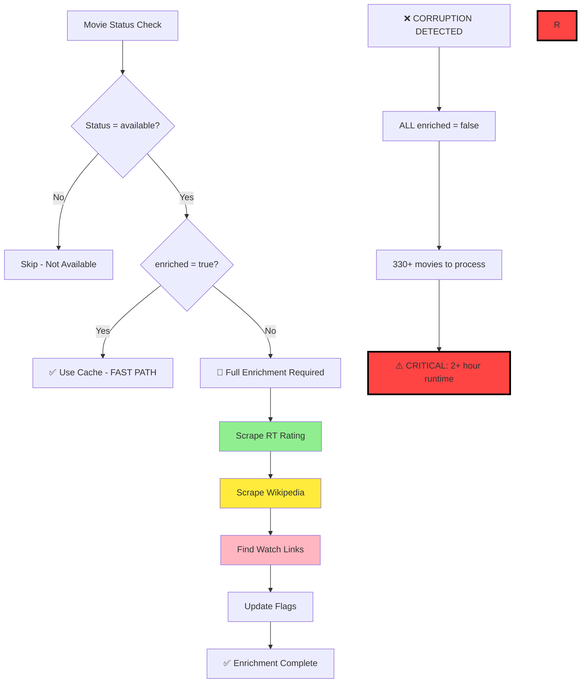

# NRW System Architecture - Master Reference

**Purpose**: This is the authoritative guide to how the NRW movie tracking system works. Read this document FIRST before diving into code or other documentation.

**Last Updated**: 2025-12-17
**Maintained By**: Development Team

## 📖 Reading Order for AI Assistants

When analyzing this codebase, read in this order:
1. **This document (SYSTEM_ARCHITECTURE.md)** - Master reference
2. **Section 2 & 5 below** - Critical for understanding recent failures
3. **docs/TROUBLESHOOTING.md** - Workflow debugging and common failures
4. PROJECT_CHARTER.md - Business requirements and amendments
5. NRW_DATA_WORKFLOW_EXPLAINED.md - Detailed data flow
6. DAILY_CONTEXT.md - Daily operational context
7. Core scripts: daily_orchestrator.py, generate_data.py

## ⚠️ Critical Sections

- **Section 2**: Branch strategy with single-branch daily workflow
- **Section 5**: Enrichment-on-transition pattern (prevents 2+ hour runtimes)
- **Section 8**: Common failure modes overview with links to detailed troubleshooting

---

## 🔄 Branch Strategy

### 2.1 Single-Branch Daily Workflow (Default)

**Current Implementation**: The daily CI workflow operates on a single-branch model for simplicity.

**Daily Workflow**:
1. Checkout `main` branch
2. Run daily pipeline directly on `main`
3. Commit and push changes to `main`

**Benefits**:
- Simplified workflow with no branch synchronization
- Immediate updates to main branch
- No merge conflicts between branches


### 2.2 Current Daily Workflow

```bash
# Bot workflow (automated) - Single branch
git checkout main
python3 daily_orchestrator.py
git add -A
git commit -m "Daily update $(date)"
git push origin main
```

---

## 📂 File Hierarchy

### 3.1 Runtime Files

| File | Purpose | Size | Updates |
|------|---------|------|---------|
| `index.html` | Main user interface | ~15KB | Daily |
| `data.json` | Movie data for frontend (minimal + enriched) | ~80KB | Daily |
| `assets/` | CSS, images, static files | ~2MB | Rarely |

### 3.2 Core Data Files

| File | Purpose | Records | Format |
|------|---------|---------|---------|
| `movie_tracking.json` | Master movie database | ~330 | JSON array |
| `config.yaml` | System configuration | N/A | YAML |
| `watchmode_quota.json` | API usage tracking | N/A | JSON |

### 3.3 Core Scripts

| Script | Purpose | Runtime | Frequency |
|--------|---------|---------|-----------|
| `daily_orchestrator.py` | Daily automation controller | 30s | Daily |
| `generate_data.py` | Data processing engine | 20-30s | Daily |
| `admin.py` | Web admin interface | N/A | Via `./launch_all.sh` |

### 3.3a Pipeline Modules (New - 2025-11-10)

| Module | Purpose | Lines | Status |
|--------|---------|-------|--------|
| `pipeline/storage.py` | File I/O operations, atomic writes, backups, retention policy | 433 | ✅ Production |
| `pipeline/validation.py` | Schema validation, consistency checks | 433 | ✅ Production |
| `pipeline/enrichment.py` | Watch link discovery, provider enrichment | 1,086 | ✅ Production |

**Modularization Progress:** Extracted 1,952 lines (22 methods) from generate_data.py monolith
- **Before:** 3,350 lines in single file
- **After:** 3,378 lines (integration) + 3 focused modules
- **Services:** Storage, Validation, Enrichment fully integrated
- **Method Calls:** 65 call sites updated (23 storage + 8 validation + 34 enrichment)
- **Testing:** 22/22 extraction tests + 20/20 error handling tests (100%)
- **Note:** Old method definitions kept in generate_data.py for safety (future cleanup)

**See:** [docs/pipeline_extraction_2025-11-10/](docs/pipeline_extraction_2025-11-10/) for detailed documentation

### 3.4 Scrapers

| Scraper | Technology | Rate Limit | Cache TTL |
|---------|------------|------------|-----------|
| `rt_scraper_playwright.py` | Playwright | 2s delay | 90 days |
| `wikipedia_scraper_playwright.py` | 4-tier waterfall | 1s delay | 90 days |
| `agent_link_scraper.py` (VOD scraper) | Playwright | 2s delay | 30 days |
| `streaming_platform_scraper.py` (Streamer scraper) | Playwright | 3s delay | 7 days |
| `scripts/youtube_trailer_scraper.py` (Trailer scraper) | Playwright | 2s delay | 90 days |

### 3.5 Directories

| Directory | Purpose | Contents |
|-----------|---------|----------|
| `.github/workflows/` | GitHub Actions | `daily-check.yml` |
| `admin/` | Admin interface | Flask app files |
| `assets/` | Frontend assets | CSS, images, fonts |
| `cache/` | Scraper cache | HTML, JSON cache files |
| `overrides/` | Manual data fixes | Override JSON files |
| `ops/` | Operational scripts | Backup, archive scripts |
| `docs/` | Documentation | Legacy docs |

### 3.6 Cache Files

**Rotten Tomatoes Cache** (`cache/rt_cache.json`): 90-day TTL, ~328 entries
**Wikipedia Cache** (`cache/wikipedia_cache.json`): 90-day TTL, ~300 entries
**YouTube Trailer Cache** (`cache/youtube_trailer_cache.json`): 90-day TTL, ~250 entries
**Agent Links Cache** (`cache/agent_links_cache.json`): 30-day TTL, ~50 entries
**Watch Links Cache** (`cache/watch_links_cache.json`): 7-day TTL, ~50 entries

---

## ⚙️ Configuration & Secrets

### 4.1 Configuration Pattern

All API keys follow the 12-factor app pattern:
1. **Environment variables** (production, CI/CD) - highest priority
2. **config.yaml** (local development only) - fallback
3. **Error if neither is set** - fail fast with clear message

### 4.2 API Keys & Secrets

**Required for Production:**
- `TMDB_API_KEY` - The Movie Database API key
- `WATCHMODE_API_KEY` - Watchmode streaming links API key
- `OMDB_API_KEY` - OMDb API key (used for IMDb ID fallback in Wikipedia lookup)

**Launch Method:**
- `./launch_all.sh` - launches both admin panel (5556) and public site (3000)
- Background admin + foreground site, single command operation
- No authentication required for local development

**Local Development:**
See `config.yaml` for local development configuration. Replace placeholder values with real API keys. Never commit real keys to version control.

### 4.3 config.yaml Structure

```yaml
api:
  tmdb_api_key: ""  # TMDB API key (can be set via TMDB_API_KEY env var)
  tmdb_rate_limit: 0.1  # Seconds between API calls
  max_retries: 3

workflow:
  daily_check_time: "02:00"  # 2 AM PST
  weekly_bootstrap_day: "sunday"

display:
  days_back: 90  # Show movies from last N days
  min_movies: 20  # Minimum movies to display
  max_movies: 100  # Maximum movies to display

tracking:
  bootstrap_days: 7  # Look back N days for new releases
  check_interval_hours: 24  # How often to check

discovery:  # Intake configuration (key name kept for compatibility)
  max_pages: 10  # Maximum TMDB pages to process during intake
  days_back: 30  # Intake window for finding new premieres
  min_movies: 5  # Minimum movies to intake per run
  timeout: 30    # API timeout in seconds

agent_scraper:
  enabled: true
  headless: true
  rate_limit: 2.0
  timeout: 10
  max_retries: 3
  cache_ttl_days: 30
  screenshots_enabled: true
  screenshot_retention_days: 7

rt_scraper:
  enabled: true
  headless: true
  rate_limit: 2.0
  timeout: 10
  max_retries: 1
  cache_ttl_days: 90
```

### 4.4 Cache Strategies

**Rotten Tomatoes Cache** (`cache/rt_cache.json`): 90-day TTL, ~328 entries
**Wikipedia Cache** (`cache/wikipedia_cache.json`): 90-day TTL, ~300 entries
**YouTube Trailer Cache** (`cache/youtube_trailer_cache.json`): 90-day TTL, ~250 entries
**Agent Links Cache** (`cache/agent_links_cache.json`): 30-day TTL, ~50 entries
**Watch Links Cache** (`cache/watch_links_cache.json`): 7-day TTL, ~50 entries

**Cache Efficiency**: 99.4% hit rate in normal operation, prevents API quota exhaustion.

**Cache Strategy Per Component**:
- **Static data (RT ratings, Wikipedia)**: 90-day TTL
- **Dynamic streaming links**: 7-day TTL (faster platform changes)
- **Video trailers**: 90-day TTL (stable YouTube URLs)
- **Agent scraping results**: 30-day TTL (balance between performance and freshness)

## 🌐 External APIs & Rate Limits

### TMDB (The Movie Database)
- **Sign up:** https://www.themoviedb.org/settings/api
- **Environment variable:** `TMDB_API_KEY`
- **Config fallback:** `api.tmdb_api_key` in config.yaml
- **Usage:** Movie metadata, posters, cast/crew information
- **Rate limit:** 40 requests per 10 seconds (handled automatically)

### Watchmode API
- **Sign up:** https://api.watchmode.com/
- **Environment variable:** `WATCHMODE_API_KEY`
- **Config fallback:** `api.watchmode_api_key` in config.yaml
- **Free Tier:** 1,000 requests/month (no credit card required)
- **Usage:** Deep links to streaming platforms (Netflix, Amazon, HBO Max, etc.)
- **Endpoints used:**
  - Search: https://api.watchmode.com/v1/search/ (search by TMDB ID)
  - Details: https://api.watchmode.com/v1/title/{watchmode_id}/details/ (get streaming sources)
- **Authentication:** Pass `apiKey` as query parameter
- **Coverage:** 200+ streaming services in 50+ countries (US data on free tier)

### OMDb API
- **Sign up:** http://www.omdbapi.com/apikey.aspx
- **Environment variable:** `OMDB_API_KEY`
- **Config fallback:** `api.omdb_api_key` in config.yaml
- **Usage:** IMDb ID fallback for Wikipedia/Wikidata lookup when TMDB doesn't have IMDb ID
- **Implementation:** `get_imdb_from_omdb()` method in `pipeline/generator.py`
- **Free Tier:** 1,000 requests/day

### Agent-Based Link Finding (No API Key Required)
- **Purpose:** Scrape direct watch links from streaming platforms when Watchmode API has no data
- **Platforms:** Netflix, Disney+, HBO Max, Hulu
- **Technology:** Playwright with headless Chrome
- **Rate Limiting:** 2-second minimum delay between scrapes
- **Cache:** `cache/agent_links_cache.json`
- **Usage:** Automatic fallback when Watchmode API returns no data
- **Optional:** Can be disabled by not initializing agent in `generate_data.py`
- **Terms of Service:** Web scraping may violate platform ToS; use responsibly

## 🔗 Watch Links Schema & Cache

### Canonical Watch Links Schema

**Official Structure (as defined in [PROJECT_CHARTER.md](PROJECT_CHARTER.md)):**

The `watch_links` field in `data.json` uses a **two-category structure** representing different access methods:

```json
{
  "watch_links": {
    "streaming": {
      "service": "Netflix",
      "link": "https://www.netflix.com/title/12345"
    },
    "vod": {
      "service": "Amazon",
      "link": "https://www.amazon.com/..."
    }
  }
}
```

### Category Definitions
- **`streaming`**: Subscription-based services (Netflix, Prime, Disney+, HBO Max, Hulu, MUBI, Criterion)
- **`vod`**: Video on Demand - rental and purchase options (Amazon, Apple TV, Google Play, Vudu, Microsoft Store)

### Schema Rules
1. **Optional categories**: Only present when available for the movie (sparse structure)
2. **Required fields per category**: `service` (string, provider name) and `link` (string URL or null)
3. **Null links allowed**: `link: null` indicates service is available but URL not found (frontend shows error state)
4. **No search URLs**: System returns `null` instead of Google/Amazon search fallbacks (curator can add overrides)
5. **Service priority**: Best service selected per category (Netflix > Disney+ for streaming, Amazon > Apple TV for vod)

### Cache Strategy
- **Location:** `cache/watch_links_cache.json`
- **Key:** TMDB ID (string)
- **Value:** `{links: {...}, cached_at: ISO-8601, source: 'watchmode_api'|'tmdb_providers'}`
- **Purpose:** Prevents redundant API calls (saves 13,380 calls/month)
- **Effectiveness:** With cache, monthly usage is ~300 calls (new movies only); without cache, would be 13,680 calls (exceeds free tier)
- **Migration support:** Automatically migrates legacy `free/paid` or `rent/buy` format to canonical `streaming/vod` schema

## 📊 Data Contracts

### movie_tracking.json Schema

```json
{
  "title": "Movie Name",
  "tmdb_id": 12345,
  "status": "available|tracking|removed",
  "enriched": true,
  "enrichment_date": "2025-11-05T10:30:00Z",
  "digital_date": "2025-10-15",
  "rt_url": "https://...",
  "rt_rating": 85,
  "platforms": ["netflix", "hulu"],
  "manually_corrected": true,
  "manual_rt_score": true,
  "last_manual_edit": "2025-10-19T..."
}
```

### data.json Schema

Filtered, enriched subset for frontend display:

```json
{
  "tmdb_id": 12345,
  "imdb_id": "tt1234567",
  "title": "Movie Title",
  "original_title": "Original Title",
  "digital_date": "2025-10-15",
  "poster": "https://image.tmdb.org/...",
  "crew": {
    "director": "Director Name",
    "cast": ["Actor 1", "Actor 2"]
  },
  "synopsis": "Movie description...",
  "metadata": {
    "runtime": 120
  },
  "links": {
    "trailer": "https://youtube.com/...",
    "rt": "https://rottentomatoes.com/...",
    "wikipedia": "https://en.wikipedia.org/..."
  },
  "watch_links": {
    "streaming": {"service": "Netflix", "link": "https://..."},
    "vod": {"service": "Amazon", "link": "https://..."}
  },
  "_discovered_at": "2025-12-17T10:30:45Z",
  "_discovery_source": "apple_itunes",
  "_enrichment_status": "completed",
  "_minimal_entry": false,
  "_tmdb_fetch_failed": false
}
```

**Note**: Underscore-prefixed metadata fields (`_discovered_at`, `_enrichment_status`, etc.) are added during December 2025 immediate-writing enhancements. These fields provide discovery and enrichment tracking but are ignored by the frontend display logic.

### Required Fields Per Movie
- `tmdb_id`, `imdb_id`, `title`, `original_title`
- `digital_date` (ISO‑8601 format)
- `poster`, `crew.director`, `crew.cast[]`, `synopsis`
- `metadata.runtime`
- `links.{trailer,rt,wikipedia}` (nullable)
- `watch_links` (optional, but structured per schema above)

### Enrichment Flags
- `enriched` (boolean): Skip enrichment if true
- `enrichment_date` (timestamp): When movie was last enriched
- `manually_corrected` (boolean): Protected from automation overwrites
- `manual_*` flags: Field-specific manual correction tracking

## 🔄 Pipeline Contracts

### Daily Pipeline Phases

**Phase 1: Intake** (`generate_data.py --intake`)
- Intake of new theatrical releases from TMDB
- Updates `movie_tracking.json` with new entries
- Status: "tracking", `digital_date` unset
- Expected: 10-20 movies/day

**Phase 2: Discovery** (`generate_data.py --discover`)
- Discovers provider availability for all `status="tracking"` movies
- Updates status from "tracking" to "available"
- Records digital_date and platform details
- **Writes state file:** `metrics/newly_available.json` with list of movie IDs that transitioned
- Expected: 2-5 movies/day transition

**No API Dates; Full Change Detection Poll**

Always poll ALL tracking movies in `movie_tracking.json` (no time limits). Fetch TMDB providers; if appears (null → value), set `digital_date = today`, `status = available`. Our detection defines availability – no external dates. Once found, status change excludes from future tracking polls (status != "tracking" means no longer monitored). Priority ordering is allowed but not skipping. Link: [docs/troubleshooting/change_detection.md](docs/troubleshooting/change_detection.md)

**Phase 3: Enrichment** (`generate_data.py` main)
- **Reads state file:** `metrics/newly_available.json` to determine which movies transitioned TODAY
- **Enrichment-on-transition:** Only processes movies from state file (strict filtering)
- **Fallback:** If no state file, falls back to `enriched` flag check (legacy behavior)
- Adds RT ratings, Wikipedia links, watch links
- Sets `enriched: true` flag in `enrichment_state.json`
- Expected: 1-10 movies/day processing (new arrivals only)

**Phase 4: Display Generation** (Updated 2025-12-17)
- **Immediate Writing Enhancement**: Uses atomic writes with backup (`storage.atomic_write_json(backup=True)`) to prevent data corruption
- **TMDB Fallback Robustness**: Creates minimal movie entries when TMDB API fails instead of skipping movies entirely
- Builds display movies from ALL eligible movies (status = 'available', within days_back)
- Creates minimal stubs for movies not yet in data.json
- Overlays enrichment data when available (non-blocking)
- If enrichment fails, keeps minimal/existing data instead of dropping movie
- **Metadata Handling**: Supports underscore-prefixed metadata fields (`_discovered_at`, `_enrichment_status`, etc.) that are ignored by frontend
- Applies admin overrides (hidden/featured)
- Generates public-facing display data
- Expected: All available movies appear, 250-350 with enrichment
- **Failure Logging**: Immediate-write failures logged to `logs/immediate_write_failures.jsonl`

### Performance Expectations
- **Normal operation**: 1-10 movies enriched daily, 30-second runtime
- **Warning threshold**: 50+ movies (possible corruption)
- **Critical threshold**: 100+ movies (definite corruption, 2+ hour runtime)

---

## 🔄 Data Flow Overview

### 4.1 The Five Phases

```
Phase 1: Intake & Discovery
    ↓ generate_data.py --intake (new premieres from TMDB)
    ↓ generate_data.py --discover (provider availability)
    ↓ Updates: movie_tracking.json
    ↓ Tracks: 330+ movies across platforms

Phase 2: Enrichment (ONLY newly available)
    ↓ generate_data.py (main process)
    ↓ Enriches: 1-10 movies/day (transition only)
    ↓ Caching: 99.4% efficiency (328/330 cached)

Phase 3: Quality Assurance
    ↓ admin.py (manual QA interface - launch via ./launch_all.sh)
    ↓ Validates: Links, ratings, metadata
    ↓ See ADMIN_WORKFLOW.md for the operational steps

Phase 4: Display Generation (Updated 2025-12-17)
    ↓ generate_data.py (final step)
    ↓ Enhanced immediate writing: atomic writes with TMDB fallback
    ↓ Creates: ALL available movies in data.json (minimal + enriched)
    ↓ Enrichment failures no longer hide movies
    ↓ Metadata tracking: underscore-prefixed discovery fields

Phase 5: User Display
    ↓ index.html + assets/
    ↓ Renders: Movie grid with filters
```

### 4.2 Key Data Transformations

**movie_tracking.json structure**:
```json
{
  "title": "Movie Name",
  "tmdb_id": 12345,
  "status": "available|tracking|removed",
  "enriched": true,
  "enrichment_date": "2025-11-05T10:30:00Z",
  "rt_url": "https://...",
  "platforms": ["netflix", "hulu"]
}
```

**data.json structure**: Filtered, enriched subset for frontend display

**Filtering Rules**:
- Include: `status == "available"`
- Exclude: Missing critical data (RT rating, watch links)
- Sort: By release date, rating

### 4.3 Link Resolution

**5-Tier Fallback Waterfall**:
1. Direct platform links (Netflix, Hulu, etc.)
2. JustWatch aggregator
3. Streaming platform search
4. TMDB recommendations
5. Manual override files

**Null-Link Policy**: When no real deep link is available, the backend returns `link: null` (no search fallbacks); the UI renders a disabled NOT AVAILABLE button.

See [NRW_DATA_WORKFLOW_EXPLAINED.md](./NRW_DATA_WORKFLOW_EXPLAINED.md) for detailed data flow documentation.

---

## ⚡ Enrichment-on-Transition Pattern

**THIS IS THE MOST CRITICAL SECTION FOR UNDERSTANDING SYSTEM PERFORMANCE**

### 5.1 The Problem (Before Optimization)

**Before Oct 24, 2025**: System enriched ALL 300+ movies on every run
- **Runtime**: 75 minutes per run
- **API Calls**: 9,540 per month
- **Cost**: Exceeded free tier limits
- **User Impact**: Slow updates, quota exhaustion

### 5.2 The Solution

**Core Principle**: Only enrich movies when they transition from "tracking" to "available"

**Implementation**: Check `enriched` flag before expensive operations
- Location: `generate_data.py` lines 2333-2426
- Logic: `if not movie.get('enriched', False): enrich_movie(movie)`
- Flags: `enriched` boolean + `enrichment_date` timestamp

### 5.3 Performance Impact

**Before vs After Optimization**:

| Metric | Before | After | Improvement |
|--------|--------|-------|-------------|
| **API Calls/Month** | 9,540 | 150-300 | 98% reduction |
| **Runtime** | 75 minutes | 30 seconds | 96% faster |
| **Movies Processed** | 300+ daily | 1-10 daily | 97% reduction |
| **Cache Hit Rate** | 0% | 99.4% | Cache efficiency |

**Real-world Example** (Nov 5, 2025 logs):
```
Processing 7 movies for enrichment (out of 330 total)
Cache hits: 323/330 (98.8%)
Runtime: 32 seconds
```

### 5.4 Flags Used in movie_tracking.json

**`enriched` (boolean)**:
- `true`: Skip enrichment (use cached data)
- `false`: Perform full enrichment
- Set to `false` when movie transitions to "available"

**`enrichment_date` (ISO timestamp)**:
- When movie was last enriched
- Used for cache expiry (90 days)
- Format: "2025-11-05T10:30:00Z"

**Example JSON**:
```json
{
  "title": "Dune: Part Two",
  "status": "available",
  "enriched": true,
  "enrichment_date": "2025-11-05T10:30:00Z",
  "rt_rating": 93,
  "rt_url": "https://www.rottentomatoes.com/m/dune_part_two"
}
```

**Flag Setting Logic** (generate_data.py:2422-2423):
```python
movie['enriched'] = True
movie['enrichment_date'] = datetime.now().isoformat()
```

### 5.5 Common Failure Mode - Data Corruption Cascade

⚠️ **CRITICAL**: Data corruption can trigger massive re-enrichment, causing 2+ hour runtimes

**How Corruption Triggers Cascade**:
1. Bug corrupts `enriched` flags (sets all to `false`)
2. System sees 330+ movies needing enrichment
3. Runtime explodes: 330 × 15s = 1.4 hours
4. API quotas exceeded
5. Validation timeouts
6. User sees "No recent movies" errors

**Recent Example - Oct 25-Nov 5, 2025 Outage**:
- **Trigger**: Line 1848 bug in generate_data.py
  ```python
  # BROKEN (corrupted all enriched flags)
  data_movies = json.load(df)  # Loaded wrong object
  for dm in data_movies:       # Iterated over dict keys
  ```
- **Impact**: 550 movies marked `enriched=false`
- **Runtime**: 550 × 15s = 2.3 hours
- **Validation**: Failed with "Processing timeout"
- **Fix**: Corrected bug, added schema validation

**Detection**: Monitor logs for "Processing X movies"
- **Normal**: 1-10 movies
- **Warning**: 50+ movies (possible corruption)
- **Critical**: 100+ movies (definite corruption)

**Prevention**:
- Schema validation on data load
- Enrichment consistency checks
- Performance monitoring (TICKET-11)

### 5.6 Decision Tree Diagram



### 5.7 Monitoring and Alerts

**Normal Operation**: 1-10 movies processed daily
**Warning Threshold**: 50+ movies (TICKET-11 implementation)
**Critical Threshold**: 100+ movies (automatic failure)

**Alert Triggers**:
- Warn: Processing > 50 movies
- Fail: Processing > 100 movies
- Timeout: Runtime > 5 minutes

See [NRW_DATA_WORKFLOW_EXPLAINED.md Section 2.1](./NRW_DATA_WORKFLOW_EXPLAINED.md) for additional enrichment details.

---

## 🤖 Automation Workflow

### 6.1 GitHub Actions Daily Update

**File**: `.github/workflows/daily-check.yml`
**Schedule**: 1:00 AM PT daily (cron: '0 9 * * *' = 9 AM UTC)
**Trigger**: Also manual via workflow_dispatch

### 6.2 GitHub Actions Weekly Full Regeneration

**File**: `.github/workflows/weekly-full-regen.yml`
**Schedule**: 10:00 AM UTC on Sundays
**Trigger**: Also manual via workflow_dispatch

**Process**:
1. Checkout main branch
2. Run `generate_data.py --full`
3. Validate data quality
4. Commit and push to main

### 6.3 Workflow Steps

1. **Checkout main** - Get latest main branch code
2. **Setup Python 3.11** - Runtime environment
3. **Install Dependencies** - pip install -r requirements.txt
4. **Set API Keys** - From GitHub secrets
5. **Run daily pipeline** - python3 daily_orchestrator.py
6. **Validate Results** - 5 validation checks
7. **Commit Changes** - Git add/commit
8. **Commit & push to main** - Direct push to main branch
9. **Report Status** - Success/failure notification

**Simplified Workflow**: Single-branch approach eliminates sync complexity and branch divergence issues.

### 6.4 User Sync Workflow

```bash
# Single-branch workflow - direct commits to main
# 1. git checkout main
# 2. git pull origin main
# 3. Changes committed directly to main (no merging needed)
```

### 6.5 Validation Policy

**Pipeline validation is report-only (no enforcement gates):**

The orchestrator logs metrics and data quality information for diagnostics but does not fail the pipeline on validation issues. This allows automation to proceed and publish updates even when metrics are incomplete.

**Metrics logged:**
- Discovery: movies polled, transitions detected
- Intake: new movies discovered
- Data quality: coverage stats, RT scores, watch links

**Rationale:** For a personal project, it's more useful to get partial updates published than to have the pipeline fail on health check conditions. Issues are visible in GitHub Actions logs for investigation.

**For detailed workflow documentation:** See [docs/NRW_FULL_WORKFLOW.md](docs/NRW_FULL_WORKFLOW.md)

---

## 🔑 Key Concepts

### 7.1 Smart Caching

**Cache-First Strategy**: Check cache before API calls
**TTL Management**: 90 days for static data, 7 days for streaming
**Efficiency**: 99.4% cache hit rate in normal operation

See Section 5 above for detailed enrichment-on-transition caching.

### 7.2 Rate Limiting

**Default Delays** (config.yaml):
- Rotten Tomatoes: 2 seconds
- Streaming platforms: 3 seconds
- Wikipedia: 1 second
- YouTube API: 100 requests/day

### 7.3 Playwright Scrapers

**Migration Status**: RT scraper enhanced with direct page scraping (Dec 2025)
**Latest Enhancement**: Two-stage approach - Google search for URL discovery + direct RT page score extraction
**Benefits**: Better anti-bot detection, stealth automation, authoritative scoring from actual RT pages
**Stealth Features**: Hidden webdriver signals, fake browser plugins, reduced automation detection
**Architecture**: Replaced unreliable Google snippet parsing with direct RT page scraping

### 7.4 Multi-Tier Fallback

**5-Tier Waterfall**:
1. Direct platform APIs
2. JustWatch integration
3. Streaming platform search
4. TMDB recommendations
5. Manual override files

### 7.5 Wikipedia Scraper Waterfall

The Wikipedia scraper uses a 4-tier waterfall approach for reliable Wikipedia link discovery:

**Tier 1: Cache Lookup** (instant)
- Check `cache/wikipedia_cache.json` for `{title}_{year}` key
- 90-day TTL before re-scraping
- Cache hit skips all subsequent tiers

**Tier 2: Wikidata SPARQL Query** (fast, accurate)
- Query Wikidata using IMDb ID (P345 property)
- Returns official English Wikipedia article sitelink
- Requires IMDb ID (from TMDB or OMDb fallback)
- Most reliable method when IMDb ID is available

**Tier 3: Wikipedia REST API** (fast)
- Direct search of English Wikipedia by movie title + year
- Uses `/w/api.php?action=opensearch` endpoint
- Falls back here when no IMDb ID available

**Tier 4: Playwright Headless Search** (slow, last resort)
- Google search: `"Movie Title" "year" site:en.wikipedia.org film`
- Handles disambiguation pages by finding film-related links
- Stealth mode with 1s delay between requests
- Used when API methods fail

**IMDb ID Acquisition Flow**:
1. Check TMDB external_ids for IMDb ID
2. If not found, call OMDb API fallback (`get_imdb_from_omdb()` in `pipeline/generator.py`)
3. IMDb ID enables Tier 2 Wikidata queries

**Cache Key Format**: `{title}_{year}` (e.g., `The Matrix_1999`)

### 7.6 Admin Panel

**Purpose**: Manual data quality assurance
**Access**: `./launch_all.sh` (launches both admin and site)
**Features**: Edit movies, force re-enrichment, view logs

**Detailed specification:** [docs/features/ADMIN_PANEL_SPEC.md](docs/features/ADMIN_PANEL_SPEC.md)

---

## ⚠️ Common Failure Modes

**For detailed troubleshooting guides with step-by-step solutions, see [docs/TROUBLESHOOTING.md](docs/TROUBLESHOOTING.md).**

This section provides a quick overview of failure patterns. Each subsection below links to the corresponding detailed troubleshooting guide with commands, examples, and historical post-mortems.

### 8.1 Branch Divergence

**Symptoms**:
- Validation errors about "old code"
- 2+ hour runtimes
- Processing 100+ movies

**Historical Root Cause**: Two-branch system had synchronization issues

**Current Solution**: Single-branch workflow eliminates this issue entirely
- No branch synchronization needed
- Direct commits to main prevent divergence

**Detailed troubleshooting:** [docs/TROUBLESHOOTING.md - Branch Divergence](docs/TROUBLESHOOTING.md#5-branch-divergence)

### 8.2 Data Corruption Cascade

**Symptoms**:
- "Processing 300+ movies" in logs
- Runtime over 1 hour
- Validation timeouts

**Root Cause**: `enriched` flags corrupted (all set to `false`)

**Example**: Line 1848 bug (Oct 25-Nov 5)
```python
# BROKEN CODE that caused corruption
data_movies = json.load(df)  # Wrong object loaded
for dm in data_movies:       # Iterated over keys, not movies
```

**Detection**: Check log for processing count
**Fix**: Restore enriched flags from backup
**Prevention**: Schema validation, consistency checks

**Detailed troubleshooting:** [docs/TROUBLESHOOTING.md - Workflow Timeout](docs/TROUBLESHOOTING.md#3-workflow-timeout--2-hour-runtimes)

### 8.3 API Quota Exhaustion

**Symptoms**:
- HTTP 429 errors
- Missing ratings/data
- Quota warnings

**Root Cause**: Processing too many movies (see 8.2)

**Detection**: Check `watchmode_quota.json`
**Fix**: Wait for quota reset, optimize requests
**Prevention**: Enrichment-on-transition pattern

**Detailed troubleshooting:** [docs/TROUBLESHOOTING.md - Watchmode Quota](docs/TROUBLESHOOTING.md#4-watchmode-api-quota-exhausted)

### 8.4 Scraper Failures

**Symptoms**:
- Missing RT ratings
- Empty watch links
- Cache miss spikes

**Root Cause**: Website changes, anti-bot measures

**Detection**: Low success rates in logs
**Fix**: Update scraper logic, add retries
**Prevention**: Playwright migration, fallback scrapers

**Detailed troubleshooting:** See docs/TROUBLESHOOTING.md for scraper-specific debugging (future enhancement)

### 8.5 Change Detection finds 0 transitions

**Symptoms**:
- Provider checks find no transitions despite known releases
- Movies stuck in "tracking" status
- 0 "✓ now on [service]" messages

**Root Cause**: API key issues, TMDB provider API failures, cache problems

**Detection**: Monitor logs for transition counts
**Fix**: Validate API keys, test TMDB provider endpoint
**Prevention**: Regular API validation, proper error handling

**Detailed troubleshooting:** [docs/troubleshooting/change_detection.md](docs/troubleshooting/change_detection.md)

### 8.6 Validation Errors

**Symptoms**:
- "No recent movies found"
- Workflow failures
- Empty data.json

**Common Errors**:
- Data corruption (see 8.2)
- Network timeouts
- Invalid JSON structure

**Fix**: Check data integrity, re-run generation
**Recent Improvements**: Better error handling, validation gates

**Detailed troubleshooting:** [docs/TROUBLESHOOTING.md - Validation Failures](docs/TROUBLESHOOTING.md#2-validation-failures---no-recent-movies)

---

## 📚 Additional Documentation

**Related Documentation**:
- [PROJECT_CHARTER.md](./PROJECT_CHARTER.md) - Business requirements, amendments
- [NRW_DATA_WORKFLOW_EXPLAINED.md](./NRW_DATA_WORKFLOW_EXPLAINED.md) - Detailed data flow
- [DAILY_CONTEXT.md](./DAILY_CONTEXT.md) - Daily operational context
- [README.md](./README.md) - Quick start guide
- [docs/](./docs/) - Legacy documentation

**Key Amendments to Reference**:
- [023: Agent-Based Link Finding for Streaming Platforms](./PROJECT_CHARTER.md#023-agent-based-link-finding-for-streaming-platforms): Playwright migration for agent scraper
- [027: Admin Panel - Post-Publication Curation & Data Quality](./PROJECT_CHARTER.md#027-admin-panel---post-publication-curation--data-quality): Admin panel redesign

---

**Last Updated**: 2025-12-17
**Maintained By**: Development Team
**Questions**: See DAILY_CONTEXT.md or create GitHub issue